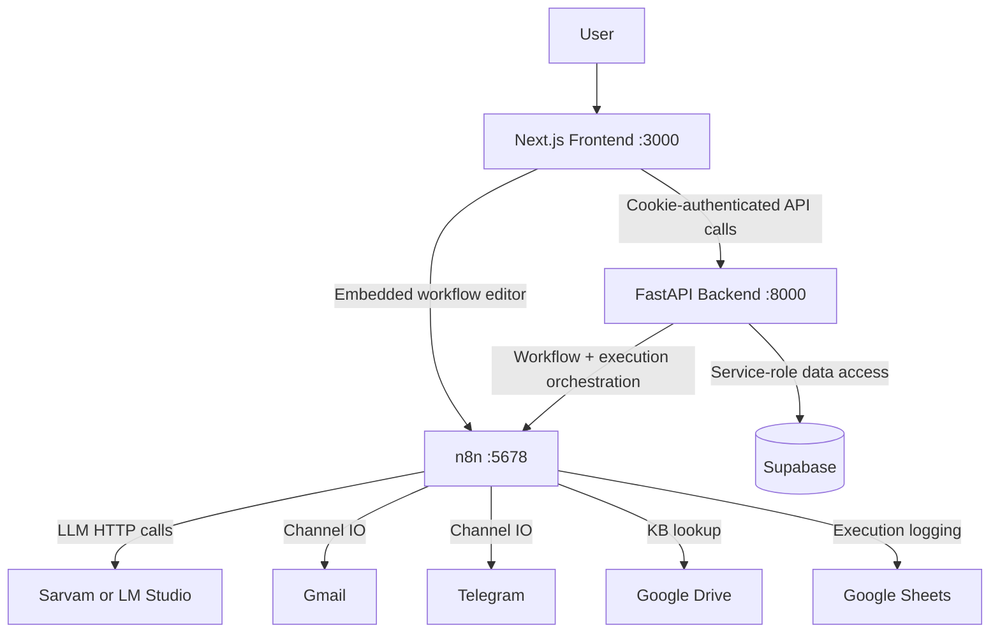
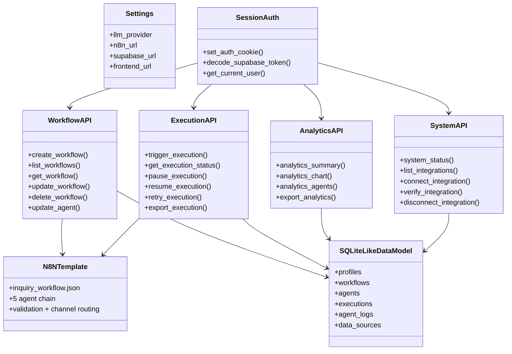
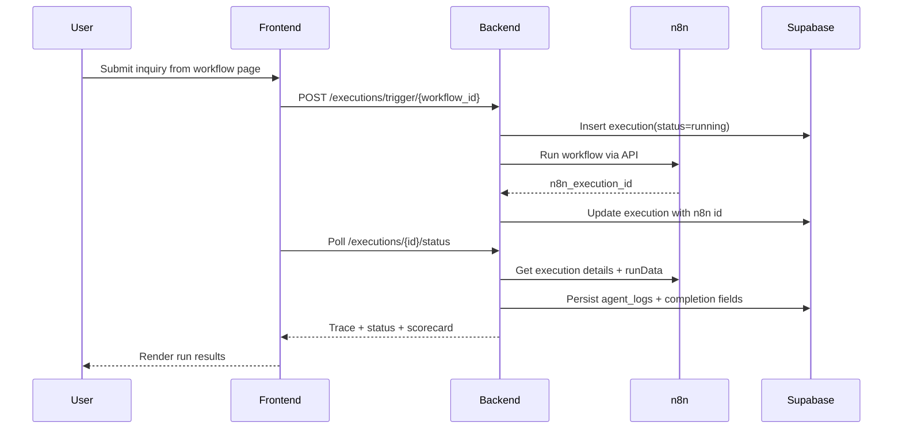
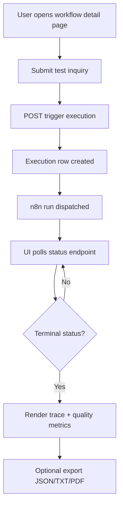

# n8n Inquiry Platform

A memoryless (workflow-driven) multi-agent customer inquiry platform built with **Next.js**, **FastAPI**, **n8n**, **Supabase**, and **OpenAI-compatible LLM providers** (Sarvam or LM Studio).

This README follows a strict architecture-document outline and maps each section to the code currently present in this repository.

---

## 1. Purpose

The goal of this project is to provide an end-to-end system that can:

- accept customer inquiries from Gmail and/or Telegram
- run them through a 5-agent pipeline (classifier, researcher, qualifier, responder, executor)
- track execution lifecycle and agent traces
- store workflow and execution data in Supabase
- expose operational analytics and exports (CSV/TXT/PDF)
- provide a local dashboard for operations, configuration, and monitoring

---

## 2. Scope

This system is an **inquiry automation and orchestration platform**, not a generic autonomous tool-use framework.

It does **not** implement:

- arbitrary external tool execution from the frontend
- general-purpose web browsing by agents
- multi-worker planner/critic swarm orchestration
- external document-index RAG subsystem

It **does** implement:

- authenticated user-facing workflow management
- n8n template cloning and synchronization
- trigger/run/pause/resume/retry/cancel execution controls
- per-agent trace capture and derived quality metrics
- integration status and connect/verify/disconnect flows
- analytics summaries and downloadable exports

---

## 3. High-Level Architecture



This reflects the runtime interaction among frontend pages, backend APIs, n8n workflows, and external integrations.

---

## 4. Component Model



---

## 5. Directory Structure

```text
.
├── backend/
│   ├── app/
│   │   ├── api/
│   │   │   ├── auth.py
│   │   │   ├── system.py
│   │   │   ├── workflows.py
│   │   │   ├── executions.py
│   │   │   └── analytics.py
│   │   ├── core/
│   │   │   ├── config.py
│   │   │   └── llm.py
│   │   ├── db/
│   │   │   └── client.py
│   │   ├── middleware/
│   │   │   └── auth.py
│   │   └── export/
│   │       ├── csv_export.py
│   │       ├── txt.py
│   │       └── pdf.py
│   ├── templates/
│   │   └── inquiry_workflow.json
│   ├── main.py
│   ├── requirements.txt
│   └── Dockerfile
├── frontend/
│   ├── src/
│   │   ├── app/
│   │   ├── components/
│   │   ├── lib/
│   │   └── proxy.ts
│   ├── package.json
│   └── Dockerfile
├── n8n/
│   └── .n8n/
├── docker-compose.yml
├── .env.example
├── graphify-out/
└── Readme.md
```

---

## 6. Core Design Decisions

### 6.1 Auth Boundary and Session Handling

FastAPI validates Supabase-issued JWTs (cookie or bearer token). The frontend stores session state via `auth-token` httpOnly cookie set by backend login.

### 6.2 Workflow Template Cloning Over Dynamic Synthesis

New workflows are created by cloning `backend/templates/inquiry_workflow.json`, patching runtime IDs and trigger enablement, then publishing to n8n.

### 6.3 Agent Prompt Sync to n8n Nodes

Agent prompt edits are stored in Supabase and synchronized into matching n8n nodes (`Classifier_Agent`, `Researcher_Agent`, etc.), ensuring UI and workflow behavior remain aligned.

### 6.4 Execution State Mapping and Derived Scorecard

n8n execution states are normalized into app states (`running`, `success`, `failed`, `cancelled`, `paused` via scorecard flag), and quality/bottleneck metrics are derived from agent logs.

---

## 7. Runtime Flow



---

## 8. Data Flow Summary

The runtime path is:

1. workflow-level inquiry input is posted to backend
2. backend creates execution record and dispatches n8n run
3. n8n executes 5-agent chain and channel actions
4. backend polls/syncs terminal state and trace from n8n
5. backend stores execution logs and derived quality metrics
6. frontend renders details in workflow, history, and analytics views
7. export endpoints generate JSON/TXT/PDF/CSV representations

---

## 9. Module Responsibilities

## `backend/app/core/config.py`

Defines environment-backed `Settings` and `get_settings()` cache.

## `backend/app/core/llm.py`

Provides provider switch (Sarvam/LM Studio) and unified chat invocation.

## `backend/app/db/client.py`

Creates Supabase anon/admin clients for auth and privileged data operations.

## `backend/app/middleware/auth.py`

Decodes Supabase JWTs, caches JWKs, and resolves current authenticated user.

## `backend/app/api/auth.py`

Registration, login/logout, profile read/update, auth-cookie lifecycle.

## `backend/app/api/system.py`

System status checks and integration connect/verify/disconnect operations.

## `backend/app/api/workflows.py`

Workflow CRUD, n8n clone/publish/update/delete, agent listing and prompt updates.

## `backend/app/api/executions.py`

Execution trigger/list/status/trace/control endpoints plus completion and exports.

## `backend/app/api/analytics.py`

Aggregated summary, trend chart data, per-agent performance, analytics export.

## `backend/app/export/*.py`

CSV, TXT, and PDF rendering for execution and analytics artifacts.

## `frontend/src/lib/api.ts`

Typed API wrapper with credentialed requests and normalized error handling.

## `frontend/src/lib/auth-context.tsx`

Client-side auth state provider (`user`, `refreshUser`, `logout`).

## `frontend/src/proxy.ts`

Route protection middleware for auth pages and dashboard pages.

## `frontend/src/app/(dashboard)/*`

Operational UI: dashboard, workflows, agents, run controls, history, analytics, profile, integrations.

---

## 10. Storage Model

### 10.1 Logical Tables

The backend reads/writes these Supabase tables:

- `profiles`
- `workflows`
- `agents`
- `executions`
- `agent_logs`
- `data_sources`

### 10.2 Record Types

Core persisted entities include:

- workflow configuration rows
- agent prompt/config rows
- execution lifecycle rows
- per-agent trace rows
- integration connection state rows

### 10.3 Scorecard Fields

Execution rows embed `scorecard_detail` including:

- inquiry sender/query context
- pause/resume lineage markers
- derived quality metrics (`relevance`, `completeness`, `overall`)
- bottleneck role/duration explanation

---

## 11. Retrieval Model

This project uses **operational retrieval**, not vector retrieval:

- n8n execution detail retrieval: `/api/v1/executions/{id}?includeData=true`
- mapping node-level run data into normalized `agent_logs`
- ordering logs by fixed agent role order
- exposing trace through `/executions/{id}/trace` and `/executions/{id}/status`

Additional retrieval includes user-scoped list queries for workflows, executions, integrations, and analytics rollups.

---

## 12. Prompting Strategy

### 12.1 Agent Prompts in Workflow Template

Each of the five agent nodes uses strict JSON-only system instructions and post-agent validation.

### 12.2 Prompt Mutability

`PUT /agents/{agent_id}` updates both persisted agent row and corresponding n8n node system prompt.

### 12.3 Validation and Guarding

Template code nodes parse and validate structured outputs (`required` keys, fallback behavior), reducing malformed downstream payloads.

---

## 13. Configuration

Key environment variables (see `.env.example`):

```env
LLM_PROVIDER=sarvam
SARVAM_API_KEY=
SARVAM_BASE_URL=https://api.sarvam.ai/v1
SARVAM_MODEL=sarvam-105b
LM_STUDIO_BASE_URL=http://host.docker.internal:1234/v1
LM_STUDIO_MODEL=local-model

N8N_URL=http://n8n:5678
N8N_API_KEY=
N8N_ENCRYPTION_KEY=
N8N_RUNNERS_AUTH_TOKEN=

SUPABASE_URL=
SUPABASE_ANON_KEY=
SUPABASE_SERVICE_ROLE_KEY=
SUPABASE_JWT_SECRET=

FRONTEND_URL=http://localhost:3000
NEXT_PUBLIC_API_URL=http://localhost:8000
```

---

## 14. CLI Interface

Primary operator interface is the **web dashboard**, not a terminal CLI.

Equivalent operational controls are exposed as pages/actions:

- workflows create/open/edit/agent-config pages
- test inquiry run controls (run/stop/pause/resume/retry)
- history + execution detail views
- analytics + export actions
- integrations connect/verify/disconnect actions

---

## 15. Execution Diagram for the UI Loop



---

## 16. Non-Functional Characteristics

### 16.1 Persistence

Workflow and execution state persists in Supabase across service restarts.

### 16.2 Availability and Retry Behavior

n8n API requests in execution paths include retry logic for transient HTTP failures.

### 16.3 Security Posture

Auth uses signed JWT verification and httpOnly cookie sessions; backend applies ownership checks before accessing workflow/execution rows.

### 16.4 Separation of Concerns

Frontend presentation, backend orchestration, n8n runtime, and persistence are isolated into dedicated modules/services.

---

## 17. Current Strengths

- clean modular API boundaries (`auth`, `system`, `workflows`, `executions`, `analytics`)
- deterministic workflow bootstrap from a proven template
- explicit execution lifecycle controls (pause/resume/retry/cancel)
- rich traceability with per-agent logs and export formats
- provider-flexible LLM integration (Sarvam and LM Studio)
- good operational observability in dashboard pages

---

## 18. Current Limitations

Based on the present codebase:

- prompt updates target known node naming conventions; template drift can break sync
- execution quality metrics are heuristic and log-driven, not model-evaluated
- integration connect/verify currently accepts credential hints but does not perform deep third-party token validation per provider
- no queue/scheduler isolation for very high execution throughput
- no built-in schema migration tooling included in this repository

---

## 19. How to Run

Install and start all services with Docker Compose:

```bash
cp .env.example .env
docker compose up --build
```

Open:

- Frontend: `http://localhost:3000`
- Backend: `http://localhost:8000`
- n8n: `http://localhost:5678`

---

## 20. Simple Mental Model

You can describe the system as:

- **Frontend** manages operator workflows and views
- **Backend** enforces auth, state transitions, and orchestration rules
- **n8n** executes the five-agent automation graph
- **Supabase** stores users, workflows, executions, traces, and integration state
- **Analytics/Export modules** turn run history into decision-ready outputs

---

## 21. Summary

This project implements a production-leaning, local-first inquiry automation stack with clear service boundaries and practical operations tooling. It handles workflow lifecycle management, executes a multi-agent n8n pipeline, tracks detailed run telemetry, and exposes analytics/export surfaces through a cohesive web dashboard.
