# n8n Multi-Agent Customer Inquiry Automation Platform

> An intelligent automation platform that processes customer inquiries from Gmail and WhatsApp using a 5-agent AI pipeline — classifying, researching, qualifying, responding, and executing — all orchestrated through n8n with a full-stack web interface.

---

## Table of Contents

1. [Project Overview](#project-overview)
2. [High-Level Architecture](#high-level-architecture)
3. [Component Model](#component-model)
4. [Core Design Decisions](#core-design-decisions)
5. [Runtime Flow](#runtime-flow)
6. [Data Flow](#data-flow)
7. [Database Schema](#database-schema)
8. [Agent Pipeline](#agent-pipeline)
9. [API Structure](#api-structure)
10. [Tech Stack](#tech-stack)
11. [Prerequisites](#prerequisites)
12. [Setup](#setup)
13. [GCP OAuth Setup](#gcp-oauth-setup)
14. [Running the Demo](#running-the-demo)
15. [Demo Script](#demo-script)
16. [Architecture Decisions](#architecture-decisions)
17. [Future Work](#future-work)

---

## Project Overview

Small teams waste hours manually checking Gmail and WhatsApp, searching Drive for answers, and updating Sheets — leading to slow replies and lost opportunities. This platform automates that entire workflow.

A user signs up, creates a multi-agent workflow, connects their Gmail and Google Drive, and from that point every incoming customer inquiry is automatically classified, researched, qualified, replied to, and logged — without any manual intervention.

**The 5 agents:**

| Agent | Role |
|---|---|
| Classifier | Identifies inquiry type and priority |
| Researcher | Looks up relevant info from Google Drive KB |
| Qualifier | Scores the lead or request 1–10 |
| Responder | Drafts a personalized reply |
| Executor | Sends the reply and logs to Sheets |

---

## High-Level Architecture

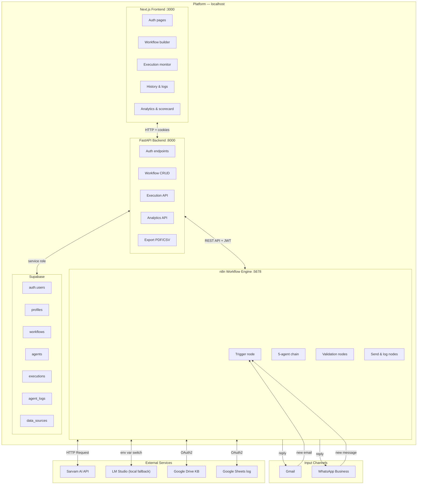

---

## Component Model

```mermaid
graph LR
    subgraph Frontend["Next.js — src/"]
        MW["middleware.ts\nroute protection"]
        AuthPages["(auth)/\nlogin, register"]
        DashPages["(dashboard)/\nworkflows, history\nanalytics, integrations"]
        Components["components/\nStatusBar\nTraceView\nAgentCard\nScorecard"]
        LibNext["lib/\napi client\nauth context"]
    end

    subgraph Backend["FastAPI — app/"]
        CoreMod["core/\nconfig.py\nllm.py"]
        APIRoutes["api/\nauth.py\nworkflows.py\nexecutions.py\nanalytics.py\nsystem.py"]
        DBMod["db/\nclient.py\nmodels.py"]
        Middleware["middleware/\nauth.py (JWT)"]
        Templates["templates/\ninquiry_workflow.json"]
        ExportMod["export/\npdf.py\ncsv.py\ntxt.py"]
    end

    subgraph N8N["n8n Workflow"]
        TriggerNode["Gmail Trigger\nWhatsApp Trigger"]
        NormalizeNode["Set node\nnormalize input"]
        AgentNodes["5 HTTP Request nodes\none per agent"]
        CodeNodes["5 Code nodes\nJSON extraction"]
        IFNodes["5 IF nodes\nvalidation routing"]
        SendNodes["Gmail Send\nWhatsApp Send"]
        SheetsNode["Google Sheets\nAppend Row"]
    end

    Frontend <--> Backend
    Backend <--> N8N
    Backend <--> DB["Supabase DB"]
    N8N <--> LLM["Sarvam / LM Studio"]
    N8N <--> Google["Google APIs\nDrive, Sheets, Gmail"]
```

---

## Core Design Decisions

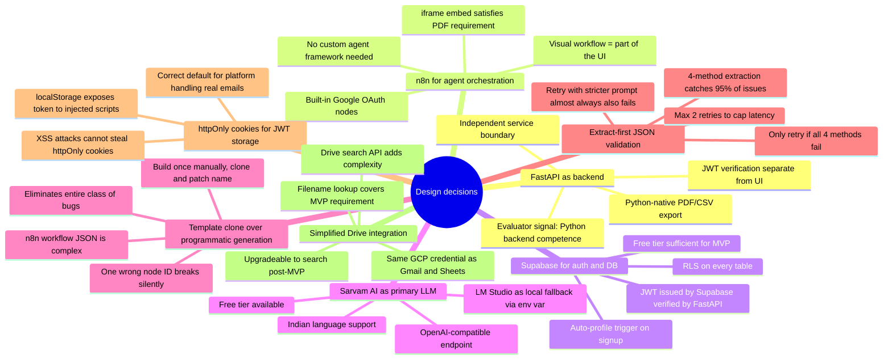

---

## Runtime Flow

### Authentication flow

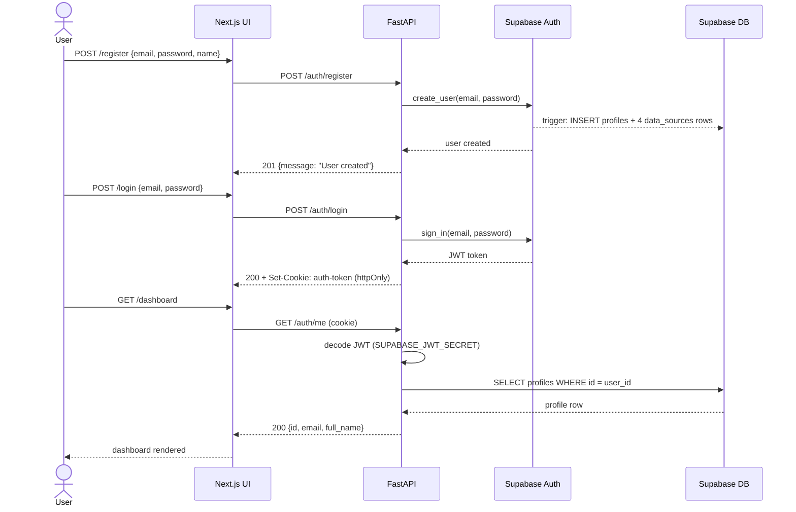

### Workflow creation flow

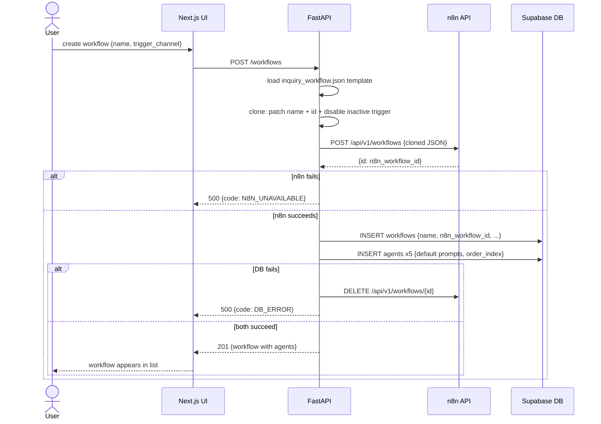

### Execution flow (the demo)

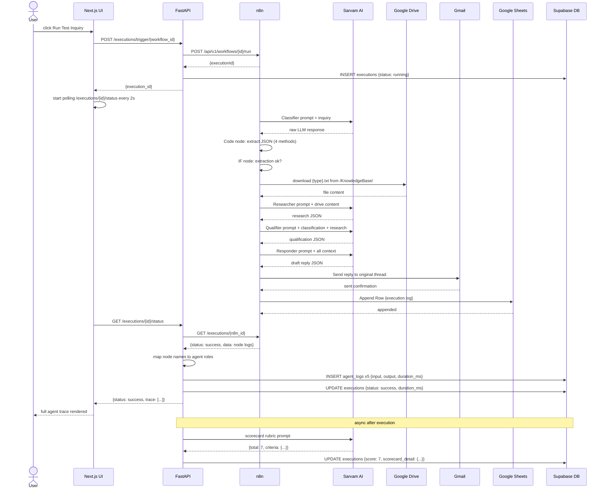

---

## Data Flow

### Input normalization

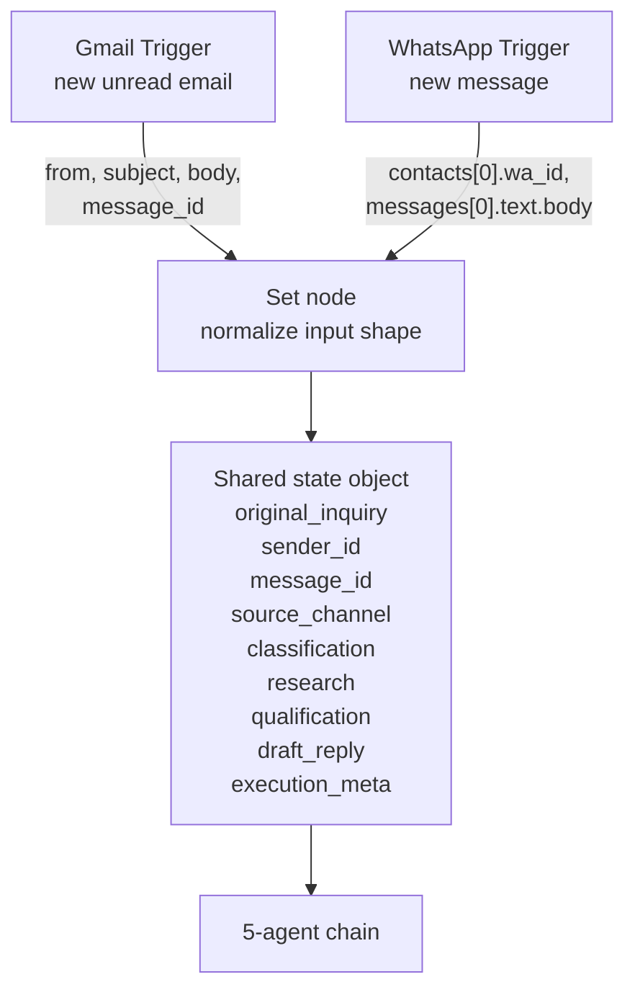

### JSON validation between agents

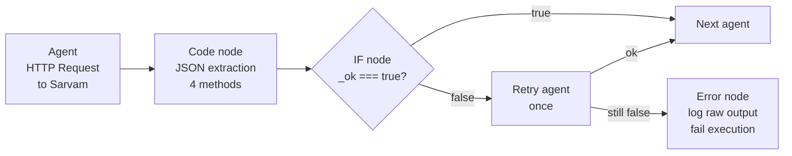

### JSON extraction cascade

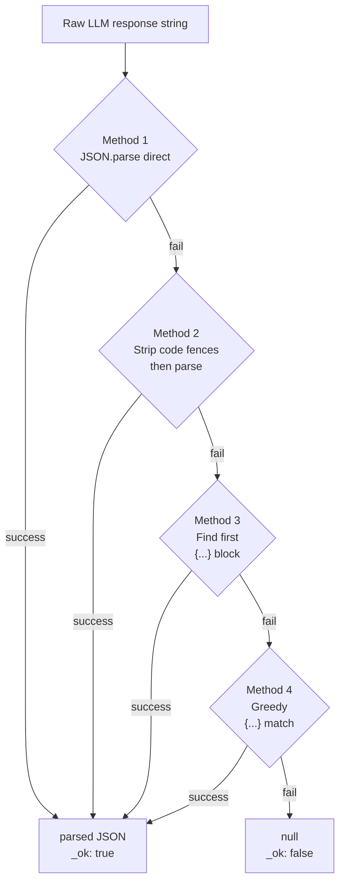

### Executor output routing

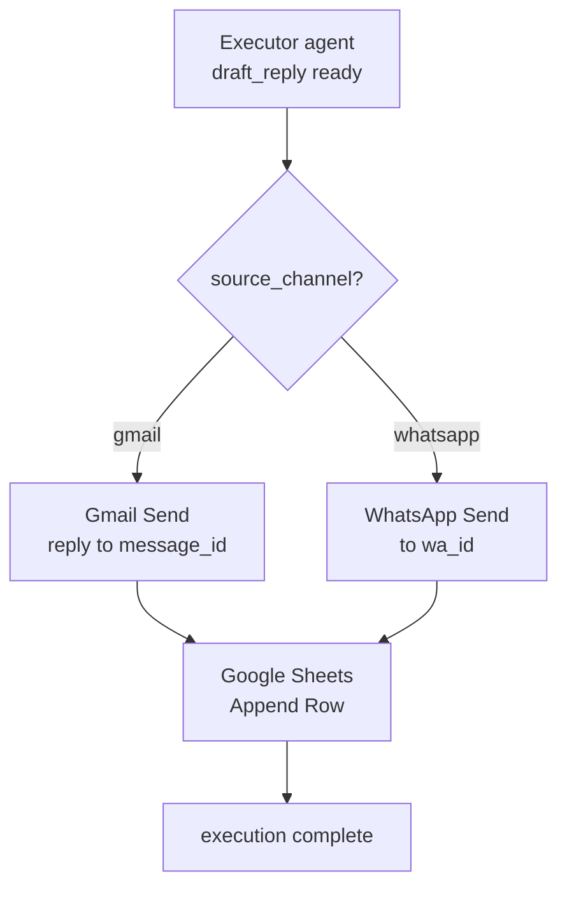

### Analytics data flow

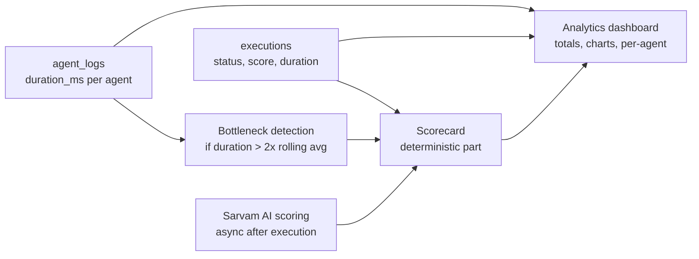

---

## Database Schema

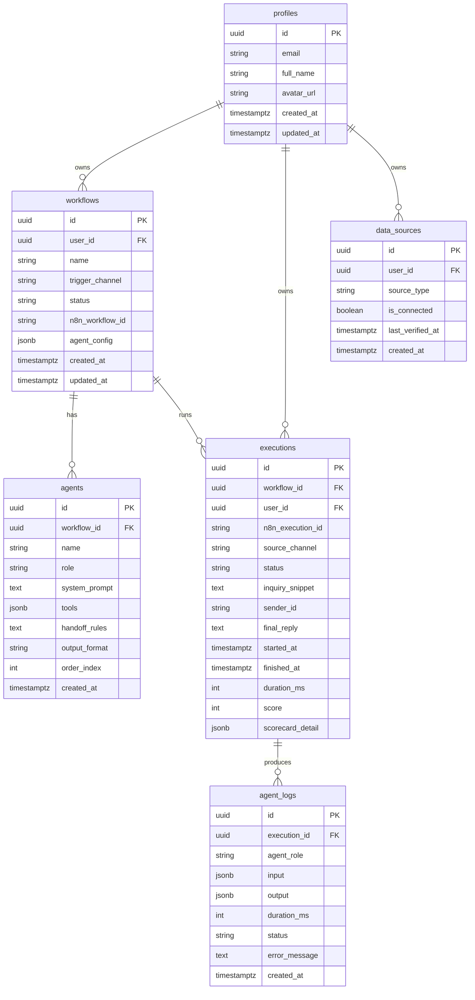

---

## Agent Pipeline

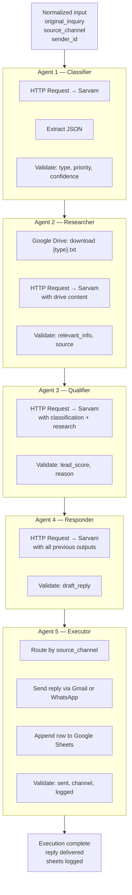

### Agent system prompts

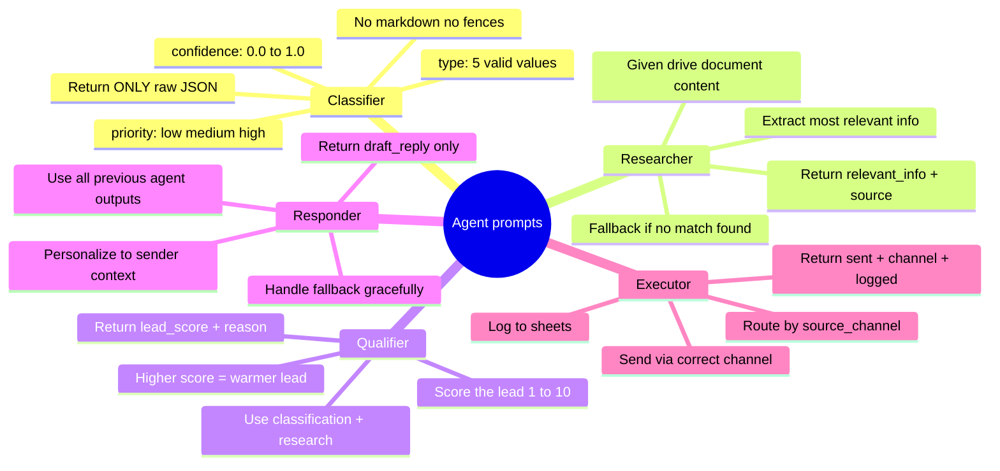

---

## API Structure

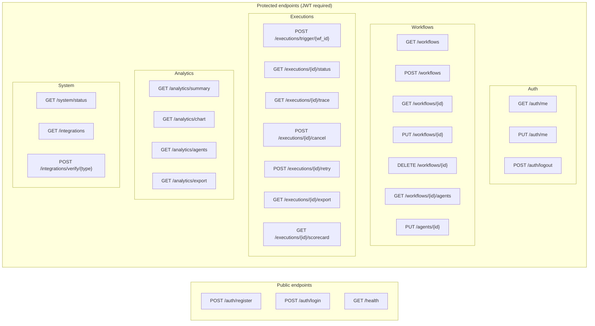

### Error response contract

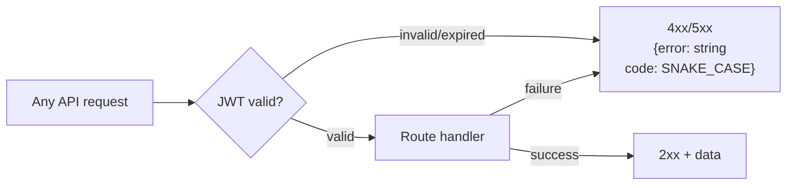

---

## Tech Stack

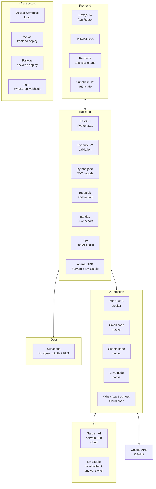

---

## Prerequisites

- Docker + Docker Compose
- Node.js 18+ (for Next.js frontend)
- Python 3.11+ (only if running FastAPI outside Docker)
- A [Supabase](https://supabase.com) account (free tier)
- A [Sarvam AI](https://dashboard.sarvam.ai) account (free tier)
- A [Google Cloud](https://console.cloud.google.com) project with Gmail, Sheets, and Drive APIs enabled
- A [Meta Developer](https://developers.facebook.com) account (for WhatsApp — optional for basic demo)
- [ngrok](https://ngrok.com) account (for WhatsApp webhook — optional)

---

## Setup

**1. Clone and configure**

```bash
git clone https://github.com/your-org/n8n-inquiry-platform
cd n8n-inquiry-platform
cp .env.example .env
```

**2. Fill in `.env`**

```env
# LLM
LLM_PROVIDER=sarvam
SARVAM_API_KEY=your_sarvam_key
SARVAM_BASE_URL=https://api.sarvam.ai/v1
SARVAM_MODEL=sarvam-30b
LM_STUDIO_BASE_URL=http://host.docker.internal:1234/v1
LM_STUDIO_MODEL=local-model

# n8n
N8N_ENCRYPTION_KEY=your_32char_random_string
N8N_URL=http://n8n:5678
N8N_API_KEY=fill_after_first_login

# Supabase
SUPABASE_URL=https://xxxx.supabase.co
SUPABASE_ANON_KEY=eyJ...
SUPABASE_SERVICE_ROLE_KEY=eyJ...
SUPABASE_JWT_SECRET=your_jwt_secret

# App
SECRET_KEY=your_random_secret
ENVIRONMENT=development
FRONTEND_URL=http://localhost:3000
```

**3. Start services**

```bash
docker compose up --build
```

**4. Set up n8n**

Open `http://localhost:5678`, create an owner account, then:

- Go to Settings → API → Enable API → copy key → paste into `.env` as `N8N_API_KEY`
- Run `docker compose restart backend`

**5. Run Supabase schema**

Copy and run `supabase/schema.sql` in your Supabase SQL Editor.

**6. Start frontend**

```bash
cd frontend
npm install
npm run dev
```

Open `http://localhost:3000`

---

## GCP OAuth Setup

One setup covers Gmail, Google Sheets, and Google Drive:

```
1. console.cloud.google.com → New Project → "n8n-hestabit"

2. APIs & Services → Library → Enable:
   - Gmail API
   - Google Sheets API
   - Google Drive API

3. APIs & Services → OAuth consent screen:
   - User type: External
   - App name: n8n-hestabit
   - Add your email as test user

4. APIs & Services → Credentials:
   - Create OAuth2 client → Web application
   - Authorized redirect URI:
     http://localhost:5678/rest/oauth2-credential/callback
   - Copy Client ID + Client Secret

5. In n8n (localhost:5678):
   - Settings → Credentials → New → Google OAuth2 API
   - Paste Client ID + Client Secret
   - Click "Sign in with Google"
   - This single credential works for Gmail, Sheets, and Drive nodes
```

---

## Running the Demo

**1. Create a workflow**

- Sign in at `http://localhost:3000`
- Go to Workflows → Create New
- Name: "Customer Inquiry Handler"
- Trigger: Gmail
- Click Create

**2. Configure agents (optional)**

- Click on the workflow → Agents tab
- Edit system prompts, tool selection, handoff rules per agent
- Click Save on each agent

**3. Set up Google Drive KB**

Create a folder `/KnowledgeBase/` in your Google Drive with these files:

```
sales_inquiry.txt
support_ticket.txt
complaint.txt
general_question.txt
order_request.txt
```

Each file should contain relevant answers for that inquiry type.

**4. Run a test inquiry**

- Go to Workflows → select your workflow → click Run Test Inquiry
- Enter: `"Hi, we're a 50-person team looking for enterprise pricing and a demo."`
- Channel: Gmail
- Click Run

**5. Watch the trace**

The UI polls every 2 seconds and shows each agent completing in sequence. When done, check your Gmail for the automated reply.

---

## Demo Script

The happy path this platform is built to handle reliably:

```
Input email:
  From:    customer@test.com
  Subject: Enterprise pricing inquiry
  Body:    "Hi, we're a 50-person team looking for an
            enterprise solution. Pricing and demo?"

Expected agent outputs:

Agent 1 — Classifier:
  {"type":"sales_inquiry","priority":"high","confidence":0.95}

Agent 2 — Researcher:
  {"relevant_info":"Enterprise plan: ₹X/month for 50+
   seats. Demo via Calendly.","source":"google_drive",
   "document_used":"sales_inquiry.txt"}

Agent 3 — Qualifier:
  {"lead_score":8,"reason":"50-person team with
   explicit purchase intent and demo request"}

Agent 4 — Responder:
  {"draft_reply":"Hi [name], thanks for reaching out!
   For a team of 50, our enterprise plan starts at
   ₹X/month... [personalized reply]"}

Agent 5 — Executor:
  {"sent":true,"channel":"gmail","logged":true}

Total time: under 30 seconds
Target reliability: 9/10 runs
```

### Test matrix

Run 10 test emails before demo day:

| # | Type | Classifier | Researcher | Qualifier | Responder | Executor | Gmail | Sheets | Pass |
|---|---|---|---|---|---|---|---|---|---|
| 1 | sales_inquiry | | | | | | | | |
| 2 | sales_inquiry | | | | | | | | |
| 3 | sales_inquiry | | | | | | | | |
| 4 | support_ticket | | | | | | | | |
| 5 | support_ticket | | | | | | | | |
| 6 | complaint | | | | | | | | |
| 7 | complaint | | | | | | | | |
| 8 | general_question | | | | | | | | |
| 9 | general_question | | | | | | | | |
| 10 | order_request | | | | | | | | |

Pass criteria: all 5 agents return valid JSON with correct required keys AND Gmail reply arrives AND Sheets row logged.

Target: 9/10 rows fully green before demo.

---

## Architecture Decisions

### Why FastAPI instead of Next.js API routes

FastAPI handles JWT auth, Supabase DB operations, n8n API orchestration, execution log processing, analytics aggregation, and file export via `reportlab`/`pandas`. These are Python-native operations. Putting this logic in Next.js API routes would mix Python-friendly data processing into a JS runtime. The service boundary also means the agent chain logic, DB layer, and UI are independently testable and deployable — important when debugging a 5-service system.

### Why n8n instead of a custom agent framework

n8n has native Gmail, Google Drive, Google Sheets, and WhatsApp Business Cloud nodes — each with built-in OAuth2 credential management. Building this with LangChain or a custom agent framework would mean implementing all of that from scratch. n8n also provides the embedded visual editor (via iframe) that the PDF explicitly requires, at zero additional cost.

### Why template clone instead of programmatic workflow generation

An n8n workflow JSON contains a nodes array, connections object, credential references, and metadata — all with matching UUIDs. One wrong node ID fails silently. The correct approach: build the 5-agent workflow once manually in n8n's UI, export it, store it as `backend/templates/inquiry_workflow.json`, and have FastAPI clone and patch only three fields: name, id, and active trigger node. This eliminates an entire class of hard-to-debug failures.

### Why extract-first JSON validation

If Sarvam returns malformed JSON, retrying with a "stricter" prompt almost always also fails — the problem is the model adding wrapper text, not a bad prompt. A 4-method extraction cascade (direct parse → strip fences → find first `{...}` → greedy match) catches 95%+ of malformed responses before any retry is needed. Retries are only triggered if all 4 extraction methods fail.

### Why simplified Drive integration (filename lookup not search)

The Drive search API adds a full authorization scope and a more complex n8n node configuration. Filename-based lookup — `download {inquiry_type}.txt from /KnowledgeBase/` — uses the same GCP credential already configured for Gmail and Sheets, takes one node, and covers the "automatic knowledge retrieval from Drive" requirement fully. Upgradeable to search post-MVP.

### Why Sarvam AI + LM Studio

Sarvam AI's `sarvam-30b` model is OpenAI-compatible (same SDK, same API shape), free-tier available, and optimized for Indian language context — directly relevant for customer inquiries from Indian businesses. LM Studio provides a local OpenAI-compatible server as a demo-day fallback if Sarvam is unavailable. Switching between them requires only changing the `LLM_PROVIDER` env var — no code changes.

---

## Future Work

Features explicitly out of scope for MVP, acknowledged for completeness:

- **Workflow template marketplace** — pre-built templates for common use cases
- **Team collaboration** — multi-user workspaces with shared workflows
- **Human-in-the-loop approval** — pause before sending sensitive replies
- **A/B testing agent prompts** — compare different system prompts on live traffic
- **Scheduled batch processing** — process accumulated inquiries on a schedule
- **Advanced cross-workflow analytics** — compare performance across multiple workflows
- **Google Drive search** — semantic search across the KB instead of filename lookup
- **Multi-language support** — Sarvam's Indic language capabilities fully utilized
- **Webhook triggers** — accept inquiries from any source beyond Gmail/WhatsApp

---

*Built for Hestabit internship — April 2026*