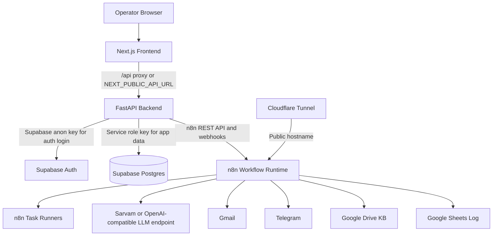
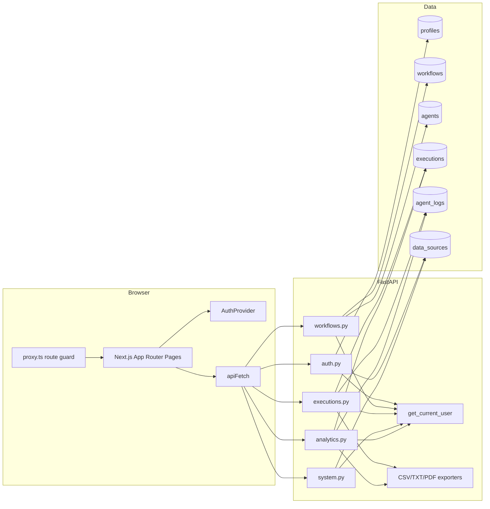
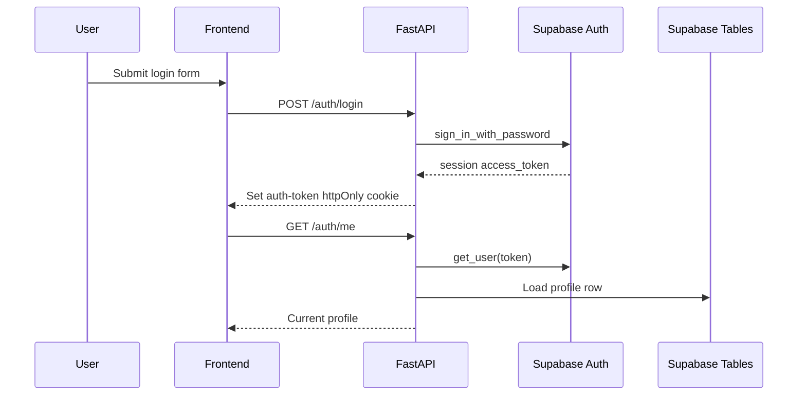
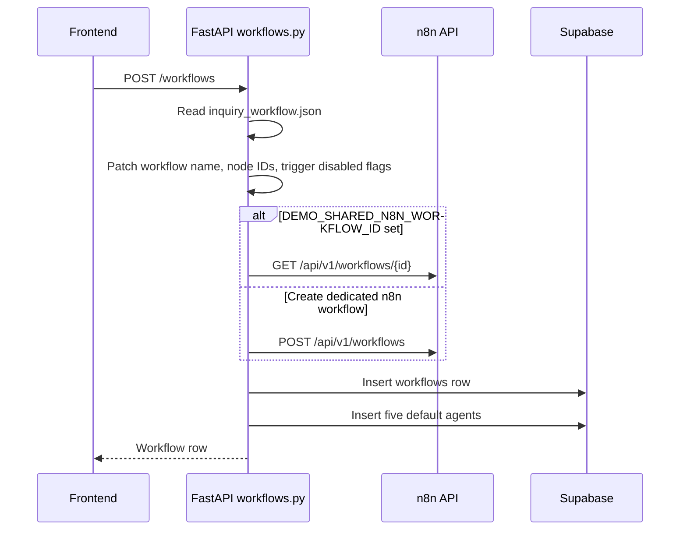
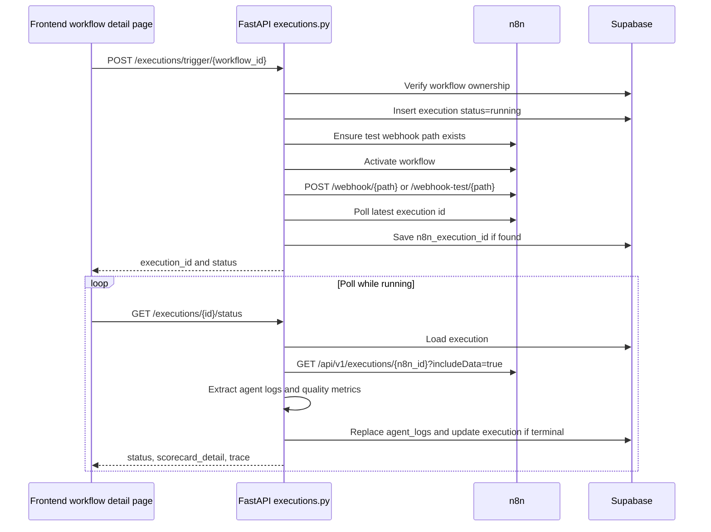
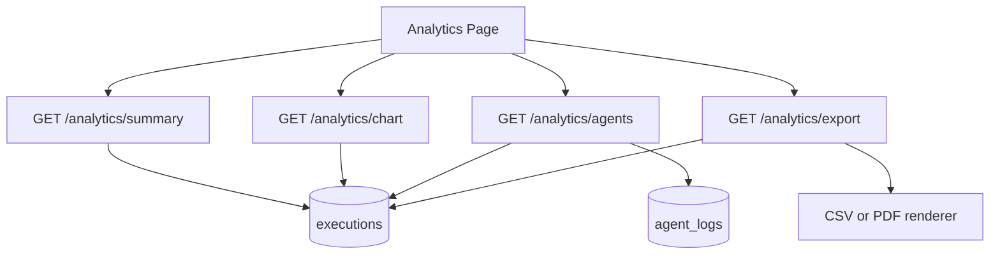
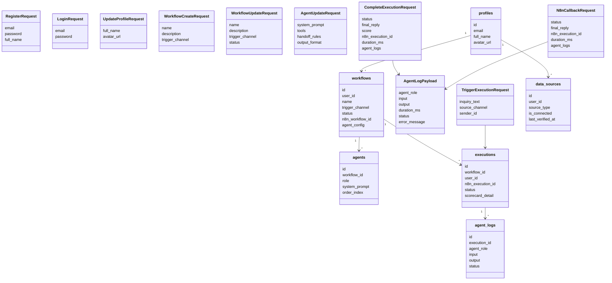
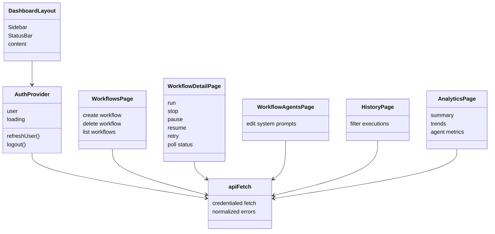
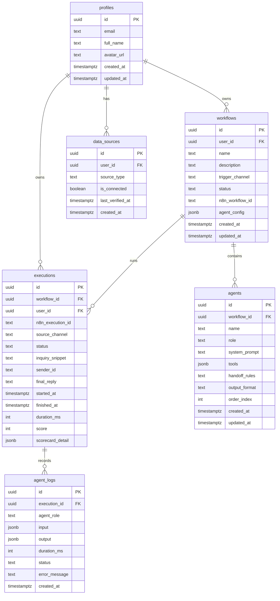
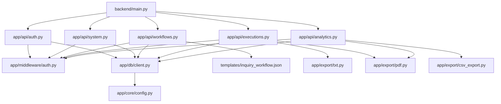

# n8n Inquiry Platform - Technical README

This document is written for a tech lead reviewing the project architecture, runtime behavior, data ownership, and file layout. It is based on the repository contents at the time of writing and avoids describing behavior that is not visible in the checked-in code.

## Table Of Contents

- [1. Executive Summary](#1-executive-summary)
- [2. System Scope](#2-system-scope)
- [3. High-Level Design](#3-high-level-design)
- [4. Runtime Architecture](#4-runtime-architecture)
- [5. Data Flow](#5-data-flow)
- [6. Class And Domain Model](#6-class-and-domain-model)
- [7. API Surface](#7-api-surface)
- [8. Storage Model](#8-storage-model)
- [9. n8n Workflow Model](#9-n8n-workflow-model)
- [10. Frontend Architecture](#10-frontend-architecture)
- [11. Backend Architecture](#11-backend-architecture)
- [12. Configuration And Deployment](#12-configuration-and-deployment)
- [13. Security And Ownership Boundaries](#13-security-and-ownership-boundaries)
- [14. Error Handling And Observability](#14-error-handling-and-observability)
- [15. Testing And Verification](#15-testing-and-verification)
- [16. Project File Inventory](#16-project-file-inventory)
- [17. Known Gaps And Risks](#17-known-gaps-and-risks)

---

## 1. Executive Summary

The project is a local-first customer inquiry automation platform built from four main services:

- **Next.js frontend** for the operator dashboard.
- **FastAPI backend** for authentication, authorization, workflow orchestration, execution lifecycle management, analytics, and exports.
- **n8n** for the actual multi-agent workflow graph and third-party channel integrations.
- **Supabase** for authentication and persistent application data.

The core product flow is:

1. A user signs in through the frontend.
2. The backend validates Supabase Auth tokens and sets an `auth-token` httpOnly cookie.
3. The user creates a workflow in the frontend.
4. The backend clones `backend/templates/inquiry_workflow.json`, creates an n8n workflow, and stores workflow and agent rows in Supabase.
5. The user triggers a test execution.
6. The backend creates an execution row and dispatches the n8n workflow.
7. n8n runs the five-agent pipeline and external channel actions.
8. The backend syncs n8n execution details into `executions` and `agent_logs`.
9. The frontend displays history, trace details, analytics, and export links.

---

## 2. System Scope

### In Scope

- Supabase-backed registration, login, logout, and profile update.
- User-owned workflow CRUD.
- n8n workflow creation from a checked-in template.
- Agent prompt storage and synchronization into n8n nodes.
- Execution trigger, status polling, trace retrieval, cancel, pause, resume, retry, and export.
- Integration status and connect/verify/disconnect state for Gmail, Telegram, Google Drive, and Google Sheets.
- Analytics summary, daily chart data, agent metrics, CSV export, TXT export, and PDF export.
- Docker Compose local deployment with n8n, n8n runners, backend, frontend, and Cloudflare Tunnel.

### Out Of Scope In The Current Codebase

- A custom graph execution engine. n8n is the graph runtime.
- A vector database or embedding-based RAG system. Google Drive knowledge-base file IDs are passed to n8n.
- A dedicated migration runner. SQL scripts are checked in under `supabase/`.
- Multi-tenant admin UI beyond per-user ownership checks.
- Production CI/CD pipeline definitions. No CI workflow files are checked in.

---

## 3. High-Level Design



### Architectural Responsibilities

| Layer | Owns | Does Not Own |
| --- | --- | --- |
| Frontend | UI state, navigation, forms, polling, export links | Direct database access, n8n mutation logic |
| Backend | Auth boundary, ownership checks, Supabase writes, n8n API calls, exports | UI rendering, n8n graph execution |
| n8n | Agent graph execution, channel integrations, LLM calls, node-level run data | App-level auth, user ownership, dashboard views |
| Supabase | Auth users and app tables | Workflow execution logic |
| Cloudflare Tunnel | Stable public n8n/webhook URL | Application routing or auth |

---

## 4. Runtime Architecture



---

## 5. Data Flow

### 5.1 Authentication Flow



The frontend stores the authenticated user in `AuthProvider`. Protected routes are guarded by `frontend/src/proxy.ts` using the `auth-token` cookie.

### 5.2 Workflow Creation Flow



### 5.3 Execution Flow



### 5.4 Analytics Flow



---

## 6. Class And Domain Model

This is not an object-oriented domain model with long-lived service classes. The backend primarily uses FastAPI route functions, Pydantic request models, and Supabase tables. The frontend uses React components and TypeScript types. The diagram below shows the effective class/domain relationships.



### Frontend Component Model



---

## 7. API Surface

### Auth

| Method | Path | Purpose |
| --- | --- | --- |
| POST | `/auth/register` | Create Supabase Auth user and seed app profile rows. |
| POST | `/auth/login` | Authenticate credentials and set `auth-token` cookie. |
| POST | `/auth/logout` | Clear `auth-token` cookie. |
| GET | `/auth/me` | Return the authenticated user's profile. |
| PUT | `/auth/me` | Update mutable profile fields. |

### System And Integrations

| Method | Path | Purpose |
| --- | --- | --- |
| GET | `/system/status` | Return n8n and integration connection booleans. |
| GET | `/system/integrations` | List per-user integration state rows. |
| POST | `/system/integrations/{source_type}/connect` | Verify a source and mark it connected. |
| POST | `/system/integrations/{source_type}/verify` | Re-verify a connected source. |
| POST | `/system/integrations/{source_type}/disconnect` | Mark a source disconnected. |

### Workflows And Agents

| Method | Path | Purpose |
| --- | --- | --- |
| POST | `/workflows` | Create a workflow and its default agents. |
| GET | `/workflows` | List current user's workflows. |
| GET | `/workflows/{workflow_id}` | Get one workflow with ordered agents. |
| PUT | `/workflows/{workflow_id}` | Update workflow metadata. |
| DELETE | `/workflows/{workflow_id}` | Delete workflow and linked n8n workflow when applicable. |
| GET | `/workflows/{workflow_id}/agents` | List ordered agents for a workflow. |
| PUT | `/agents/{agent_id}` | Update agent config and sync system prompt into n8n. |

### Executions

| Method | Path | Purpose |
| --- | --- | --- |
| POST | `/executions/trigger/{workflow_id}` | Create and dispatch a new execution. |
| GET | `/executions` | List executions with optional status/channel filters. |
| GET | `/executions/{execution_id}` | Get one execution and logs. |
| GET | `/executions/{execution_id}/status` | Return latest status and sync from n8n if possible. |
| GET | `/executions/{execution_id}/trace` | Return ordered agent logs only. |
| POST | `/executions/{execution_id}/cancel` | Mark running execution cancelled and try to stop n8n execution. |
| POST | `/executions/{execution_id}/pause` | Mark running execution paused using `scorecard_detail.paused`. |
| POST | `/executions/{execution_id}/resume` | Create a new run from a paused execution. |
| POST | `/executions/{execution_id}/retry` | Create a retry run from any existing execution. |
| POST | `/executions/{execution_id}/agent-logs` | Append logs from test clients or callbacks. |
| POST | `/executions/{execution_id}/complete` | Mark an execution complete and save logs. |
| GET | `/executions/{execution_id}/export` | Export one execution as JSON, TXT, or PDF. |
| POST | `/executions/{execution_id}/n8n-callback` | Receive n8n callback protected by shared secret. |

### Analytics

| Method | Path | Purpose |
| --- | --- | --- |
| GET | `/analytics/summary` | Aggregate counts, success rate, duration, and scores. |
| GET | `/analytics/chart` | Return daily execution count data. |
| GET | `/analytics/agents` | Return per-agent duration, success, and bottleneck data. |
| GET | `/analytics/export` | Export analytics data as CSV or PDF. |

### Health

| Method | Path | Purpose |
| --- | --- | --- |
| GET | `/health` | Return minimal service health and environment metadata. |

---

## 8. Storage Model

The canonical schema is `supabase/schema.sql`.



### Important Storage Notes

- RLS is enabled on all application tables.
- Backend code uses the Supabase service-role client for application-owned queries.
- Ownership is still checked in backend route handlers before returning user-owned resources.
- `executions.status` in SQL allows `running`, `success`, `failed`, and `cancelled`. The app represents pause state through `scorecard_detail.paused` and returns display status `paused`.
- `data_sources` has a unique constraint on `(user_id, source_type)`.
- Signup trigger `handle_new_user()` creates a `profiles` row and default `data_sources` rows.

---

## 9. n8n Workflow Model

The backend-created workflow comes from `backend/templates/inquiry_workflow.json`.

### Template Responsibilities

- Normalize incoming Gmail, Telegram, and browser-test webhook payloads.
- Run five logical agents:
  - classifier
  - researcher
  - qualifier
  - responder
  - executor
- Parse and validate JSON outputs between agent steps.
- Retrieve knowledge-base content from Google Drive using configured file IDs.
- Route delivery/logging steps through Gmail, Telegram, and Google Sheets nodes.
- Call back or expose execution data for backend synchronization.

### Backend Template Handling

`backend/app/api/workflows.py`:

- loads the template from disk,
- removes template IDs and active state,
- assigns a workflow name,
- creates a unique browser-test webhook path,
- toggles Gmail/Telegram trigger nodes based on `trigger_channel`,
- sends the sanitized payload to n8n.

### Prompt Synchronization

Agent prompt edits are stored in Supabase and synced into n8n by matching role to node name:

| Agent Role | n8n Node Name |
| --- | --- |
| classifier | `Classifier_Agent` |
| researcher | `Researcher_Agent` |
| qualifier | `Qualifier_Agent` |
| responder | `Responder_Agent` |
| executor | `Executor_Agent` |

The code also recognizes `*Agent1` names while extracting logs from n8n execution payloads.

---

## 10. Frontend Architecture

The frontend is a Next.js App Router application.

### Frontend Layers

| Layer | Files | Responsibility |
| --- | --- | --- |
| App shell | `layout.tsx`, `providers.tsx`, dashboard layout | Global styles, providers, dashboard shell |
| Auth state | `src/lib/auth-context.tsx` | Current user, refresh, logout |
| API client | `src/lib/api.ts` | Credentialed fetch, normalized `ApiRequestError` |
| Route guard | `src/proxy.ts` | Redirect unauthenticated users away from dashboard routes |
| Pages | `src/app/**/page.tsx` | User flows and views |
| Components | `src/components/*.tsx` | Shared sidebar and status bar |
| Styles | `src/app/globals.css` | Global CSS for dashboard and forms |

### Frontend Routing

| Route | File | Purpose |
| --- | --- | --- |
| `/` | `src/app/page.tsx` | Redirect to `/dashboard` or `/login`. |
| `/login` | `src/app/(auth)/login/page.tsx` | Login form. |
| `/register` | `src/app/(auth)/register/page.tsx` | Registration form. |
| `/dashboard` | `src/app/(dashboard)/dashboard/page.tsx` | Overview metrics and latest run. |
| `/workflows` | `src/app/(dashboard)/workflows/page.tsx` | Create, list, open, edit, and delete workflows. |
| `/workflows/[id]` | `src/app/(dashboard)/workflows/[id]/page.tsx` | Workflow detail, test execution, lifecycle controls, live trace. |
| `/workflows/[id]/agents` | `src/app/(dashboard)/workflows/[id]/agents/page.tsx` | Agent prompt editing. |
| `/workflows/[id]/edit` | `src/app/(dashboard)/workflows/[id]/edit/page.tsx` | Link to n8n editor. |
| `/history` | `src/app/(dashboard)/history/page.tsx` | Filterable execution history. |
| `/history/[id]` | `src/app/(dashboard)/history/[id]/page.tsx` | Execution detail and export links. |
| `/analytics` | `src/app/(dashboard)/analytics/page.tsx` | Analytics summary, trend, and agent metrics. |
| `/profile` | `src/app/(dashboard)/profile/page.tsx` | Profile update form. |
| `/settings/integrations` | `src/app/(dashboard)/settings/integrations/page.tsx` | Integration connect, verify, disconnect controls. |
| `/api/[...path]` | `src/app/api/[...path]/route.ts` | Same-origin proxy to internal FastAPI service. |

---

## 11. Backend Architecture

The backend is a FastAPI application with routers grouped by domain.

### Backend Module Map



### Backend Domain Responsibilities

| Module | Responsibility |
| --- | --- |
| `main.py` | FastAPI app setup, CORS, router registration, health endpoint. |
| `app/core/config.py` | Pydantic settings loaded from environment variables. |
| `app/core/llm.py` | OpenAI-compatible LLM client helper. Present in code but not wired into the route handlers that dispatch n8n. |
| `app/db/client.py` | Supabase anon and service-role client factories. |
| `app/middleware/auth.py` | Auth dependency using Supabase `auth.get_user(token)`. |
| `app/api/auth.py` | Auth and profile routes. |
| `app/api/system.py` | System status and integration state routes. |
| `app/api/workflows.py` | Workflow CRUD, n8n template clone, prompt sync. |
| `app/api/executions.py` | Execution lifecycle, n8n dispatch/sync, trace extraction, export. |
| `app/api/analytics.py` | Aggregated analytics and analytics export. |
| `app/export/*.py` | Report rendering helpers. |

---

## 12. Configuration And Deployment

### Docker Compose Services

| Service | Image/Build | Purpose |
| --- | --- | --- |
| `n8n` | `n8nio/n8n:2.18.5` | Workflow editor and runtime. |
| `task-runners` | `n8nio/runners:2.18.5` | External n8n runners for code-heavy nodes. |
| `cloudflared` | `cloudflare/cloudflared:latest` | Public tunnel for stable n8n webhook/editor URL. |
| `backend` | `./backend` | FastAPI app on port `8000`. |
| `frontend` | `./frontend` | Next.js app on configurable port, default `3000`. |

### Important Environment Variables

| Variable | Used By | Purpose |
| --- | --- | --- |
| `LLM_PROVIDER` | backend | Selects `sarvam` or `lmstudio` in `app/core/llm.py`. |
| `SARVAM_*` | backend, n8n | Sarvam LLM configuration. |
| `LM_STUDIO_*` | backend | Local OpenAI-compatible fallback configuration. |
| `N8N_URL` | backend | Internal n8n API base URL. |
| `N8N_API_KEY` | backend | API key for n8n REST calls. |
| `N8N_CALLBACK_SECRET` | backend, n8n | Shared secret for callback endpoint. |
| `DEMO_SHARED_N8N_WORKFLOW_ID` | backend | Optional shared n8n workflow instead of per-workflow clone. |
| `SUPABASE_URL` | backend | Supabase project URL. |
| `SUPABASE_ANON_KEY` | backend | Supabase auth client key. |
| `SUPABASE_SERVICE_ROLE_KEY` | backend | Privileged app data access. |
| `FRONTEND_URL` | backend | CORS origin. |
| `AUTH_COOKIE_DOMAIN` | backend | Optional cookie domain. |
| `AUTH_COOKIE_SECURE` | backend | Secure cookie flag. |
| `NEXT_PUBLIC_API_URL` | frontend | Browser-visible API base, default `/api`. |
| `INTERNAL_API_URL` | frontend API proxy | Internal FastAPI URL from Next.js server. |
| `NEXT_PUBLIC_N8N_EDITOR_URL` | frontend | n8n editor link target. |
| `WEBHOOK_URL`, `N8N_HOST`, `N8N_PROTOCOL`, `N8N_EDITOR_BASE_URL` | n8n | Public n8n URL settings. |
| `CLOUDFLARED_TUNNEL_TOKEN` | cloudflared | Tunnel authentication token. |
| `GOOGLE_*`, `TELEGRAM_*`, `GMAIL_SEND_MODE` | n8n/backend | External integration configuration. |

### Local Startup

```bash
cp .env.example .env
docker compose up --build
```

Default local entry points:

- Frontend: `http://localhost:3000`
- Backend: `http://localhost:8000`
- n8n local port: `http://localhost:5678`
- n8n public URL when configured: `https://n8n.anshul-garg.com`

---

## 13. Security And Ownership Boundaries

### Authentication

- Login delegates to Supabase Auth.
- The backend stores the Supabase access token in `auth-token`.
- `auth-token` is configured as httpOnly and `SameSite=Lax`.
- Backend routes use `get_current_user` to validate either bearer credentials or the cookie.

### Authorization

- Backend route handlers query resources by both ID and `current_user["id"]` where ownership matters.
- Supabase RLS policies are defined in `supabase/schema.sql`.
- Backend uses service-role access, so application-level ownership checks are critical.

### Integration Secrets

- Secrets are read from environment variables.
- `.env` is ignored and should not be committed.
- `.env.example` documents required variables without real secrets.

### Callback Security

- `/executions/{execution_id}/n8n-callback` checks `X-Callback-Secret` against `N8N_CALLBACK_SECRET`.
- If `N8N_CALLBACK_SECRET` is not configured, the callback endpoint returns a service-unavailable error.

---

## 14. Error Handling And Observability

### API Error Shape

Backend routers use helper functions that raise:

```json
{
  "detail": {
    "error": "Human-readable message",
    "code": "MACHINE_READABLE_CODE"
  }
}
```

Frontend `apiFetch` unwraps this shape into `ApiRequestError`.

### n8n Failure Handling

`backend/app/api/executions.py`:

- retries n8n API requests for transient HTTP statuses,
- attempts both webhook and fallback run API dispatch paths,
- stores trigger failures in `scorecard_detail.n8n_trigger_error`,
- maps n8n statuses to app statuses,
- catches status-sync failures in polling and returns the current local row when needed.

### Execution Trace Observability

The backend extracts n8n `runData` into normalized `agent_logs`:

- role,
- input,
- output,
- duration,
- status,
- error message.

It also derives heuristic scorecard fields:

- relevance score,
- completeness score,
- overall quality score,
- bottleneck role,
- bottleneck duration and explanation.

---

## 15. Testing And Verification

### Checked-In Tests

| File | Coverage |
| --- | --- |
| `backend/tests/test_auth_middleware.py` | Auth token handling, invalid/expired token mapping, cookie/bearer source behavior. |
| `backend/tests/test_auth_me.py` | `/auth/me` profile fetch and profile repair behavior using fake Supabase clients. |
| `frontend/tests/login-refresh.test.mjs` | Frontend login refresh behavior test script. |

### Verification Documents

The `docs/` directory contains manual verification notes and artifacts for auth, frontend, execution, analytics, and test matrix work.

### Useful Commands

```bash
# Backend syntax check
python3 -m compileall backend/app backend/main.py

# Frontend lint
cd frontend
npm run lint
```

The repository does not currently include a single top-level test runner script that runs all backend and frontend tests together.

---

## 16. Project File Inventory

This inventory covers checked-in project files visible outside ignored runtime/dependency folders. Generated caches, virtualenvs, `node_modules`, `.git`, and local n8n runtime database files are intentionally excluded.

### Root

| File | Purpose |
| --- | --- |
| `Readme.md` | Existing project README with overview, architecture notes, and run instructions. |
| `TECHNICAL_README.md` | This tech-lead-oriented architecture and file inventory document. |
| `.env.example` | Template for runtime configuration. |
| `.gitignore` | Git ignore rules for secrets, dependencies, runtime data, and generated output. |
| `.graphifyignore` | Ignore rules for Graphify code graph generation. |
| `.mcp.json` | Local MCP server/tooling configuration. |
| `.codex` | Codex-related local/project configuration file. |
| `docker-compose.yml` | Local multi-service stack definition. |
| `smoke_test.sh` | Shell smoke test script. |
| `opencode.json` | OpenCode configuration at repository root. |
| `appa.json` | Standalone n8n workflow export. It is not referenced by backend code paths found in the repo. |
| `questionnaire.md` | Project questionnaire and rationale notes. |
| `user_guide.md` | End-user guide documentation. |
| `7-day-catchup-sprint.md` | Sprint planning/catch-up notes. |
| `whats_left.md` | Remaining work notes. |
| `n8n-Multi-Agent-Customer-Inquiry-Automation-Platform-1776146892275.pdf` | Project PDF artifact. |

### Backend

| File | Purpose |
| --- | --- |
| `backend/main.py` | FastAPI app creation, CORS setup, router inclusion, `/health`. |
| `backend/pyproject.toml` | Python package metadata and backend dependencies. |
| `backend/requirements.txt` | Pip requirements for backend runtime. |
| `backend/uv.lock` | Locked Python dependency graph generated by `uv`. |
| `backend/Dockerfile` | Backend container build definition. |
| `backend/.dockerignore` | Backend Docker build ignore rules. |
| `backend/templates/inquiry_workflow.json` | n8n workflow template cloned by backend workflow creation. |

### Backend Application Modules

| File | Purpose |
| --- | --- |
| `backend/app/api/__init__.py` | API package marker. |
| `backend/app/api/auth.py` | Registration, login, logout, profile read/update. |
| `backend/app/api/system.py` | System status and integration connection state. |
| `backend/app/api/workflows.py` | Workflow CRUD, n8n clone/update/delete, agent prompt sync. |
| `backend/app/api/executions.py` | Execution trigger, polling, lifecycle controls, n8n sync, trace extraction, exports, callbacks. |
| `backend/app/api/analytics.py` | Execution summary, chart data, agent metrics, analytics export. |
| `backend/app/core/config.py` | Environment-backed `Settings` model and cached settings getter. |
| `backend/app/core/llm.py` | OpenAI-compatible LLM helper for Sarvam or LM Studio. |
| `backend/app/db/__init__.py` | Database package marker. |
| `backend/app/db/client.py` | Supabase anon and service-role client factories. |
| `backend/app/middleware/__init__.py` | Middleware package marker. |
| `backend/app/middleware/auth.py` | FastAPI auth dependency and Supabase token validation. |
| `backend/app/export/__init__.py` | Export package marker. |
| `backend/app/export/csv_export.py` | CSV renderer for execution analytics. |
| `backend/app/export/txt.py` | Plain-text execution report renderer. |
| `backend/app/export/pdf.py` | PDF execution report renderer. |

### Backend Tests

| File | Purpose |
| --- | --- |
| `backend/tests/__init__.py` | Test package marker. |
| `backend/tests/test_auth_middleware.py` | Unit tests for auth dependency behavior. |
| `backend/tests/test_auth_me.py` | Unit tests for profile read/repair behavior. |

### Frontend

| File | Purpose |
| --- | --- |
| `frontend/package.json` | Frontend package metadata, scripts, dependencies. |
| `frontend/package-lock.json` | Locked npm dependency graph. |
| `frontend/next.config.js` | Next.js configuration. |
| `frontend/eslint.config.mjs` | ESLint configuration. |
| `frontend/tsconfig.json` | TypeScript configuration. |
| `frontend/next-env.d.ts` | Next.js generated TypeScript environment declarations. |
| `frontend/Dockerfile` | Frontend container build definition. |
| `frontend/.dockerignore` | Frontend Docker build ignore rules. |
| `frontend/docker-entrypoint.sh` | Frontend container entrypoint script. |

### Frontend Source

| File | Purpose |
| --- | --- |
| `frontend/src/app/layout.tsx` | Root HTML layout and provider installation. |
| `frontend/src/app/providers.tsx` | Client-side provider wrapper. |
| `frontend/src/app/page.tsx` | Root redirect based on `auth-token` cookie. |
| `frontend/src/app/globals.css` | Global styles. |
| `frontend/src/app/api/[...path]/route.ts` | Next.js API proxy to internal FastAPI backend. |
| `frontend/src/app/(auth)/login/page.tsx` | Login page and submit handler. |
| `frontend/src/app/(auth)/register/page.tsx` | Registration page and submit handler. |
| `frontend/src/app/(dashboard)/layout.tsx` | Dashboard shell with sidebar and status bar. |
| `frontend/src/app/(dashboard)/dashboard/page.tsx` | Dashboard summary and latest execution view. |
| `frontend/src/app/(dashboard)/workflows/page.tsx` | Workflow list/create/delete UI. |
| `frontend/src/app/(dashboard)/workflows/[id]/page.tsx` | Workflow detail, test execution form, execution controls, live trace. |
| `frontend/src/app/(dashboard)/workflows/[id]/agents/page.tsx` | Agent prompt editor. |
| `frontend/src/app/(dashboard)/workflows/[id]/edit/page.tsx` | n8n editor deep link page. |
| `frontend/src/app/(dashboard)/history/page.tsx` | Filterable execution history. |
| `frontend/src/app/(dashboard)/history/[id]/page.tsx` | Execution detail and export links. |
| `frontend/src/app/(dashboard)/analytics/page.tsx` | Analytics summary, trend, agent metrics, export links. |
| `frontend/src/app/(dashboard)/profile/page.tsx` | Profile edit page. |
| `frontend/src/app/(dashboard)/settings/integrations/page.tsx` | Integration connection management page. |
| `frontend/src/components/Sidebar.tsx` | Dashboard navigation and logout control. |
| `frontend/src/components/StatusBar.tsx` | Integration health polling chips. |
| `frontend/src/lib/api.ts` | Typed API client and API error normalization. |
| `frontend/src/lib/auth-context.tsx` | Auth context, current-user loading, refresh, logout. |
| `frontend/src/proxy.ts` | Next.js route guard for protected and auth routes. |

### Frontend Tests

| File | Purpose |
| --- | --- |
| `frontend/tests/login-refresh.test.mjs` | Login refresh behavior test. |

### Supabase

| File | Purpose |
| --- | --- |
| `supabase/schema.sql` | Base schema, indexes, triggers, RLS policies. |
| `supabase/fix_registration_telegram_schema.sql` | Schema fix script related to registration and Telegram data-source setup. |
| `supabase/make_signup_trigger_non_blocking.sql` | Signup trigger adjustment script. |
| `supabase/disable_custom_signup_trigger.sql` | Script to disable custom signup trigger. |

### Documentation And Artifacts

| File | Purpose |
| --- | --- |
| `docs/test-matrix.md` | Manual/functional test matrix. |
| `docs/day-3-auth-verification.md` | Auth verification notes. |
| `docs/day-5-frontend-verification.md` | Frontend verification notes. |
| `docs/day-6-execution-verification.md` | Execution verification notes. |
| `docs/day-7-analytics-verification.md` | Analytics verification notes. |
| `docs/mock-sales-data.md` | Mock sales data for demos/tests. |
| `docs/day7-artifacts/execution-8e6a956b.json` | Example execution export artifact. |
| `docs/day7-artifacts/execution-8e6a956b.txt` | Example TXT execution report artifact. |
| `docs/day7-artifacts/execution-8e6a956b.pdf` | Example PDF execution report artifact. |
| `docs/day7-artifacts/analytics-executions.csv` | Example analytics CSV artifact. |
| `docs/day7-artifacts/analytics-summary.pdf` | Example analytics PDF artifact. |

### Generated Or Local Tooling

| Path | Purpose |
| --- | --- |
| `graphify-out/` | Generated Graphify code graph output. Ignored by git. |
| `.opencode/` | Local OpenCode plugin/dependency folder. Ignored or tooling-specific. |
| `.claude/settings.local.json` | Claude local settings. |
| `.claude/skills/software-architect/SKILL.md` | Local software-architect skill instructions. |
| `.claude/skills/software-architect/.skillfish.json` | Metadata for the local software-architect skill. |
| `.idea/` | Local JetBrains IDE project files. |
| `.obsidian/` | Local Obsidian workspace configuration. |
| `n8n/.n8n/` | Local n8n runtime database/config/log volume. Ignored runtime data. |

---

## 17. Known Gaps And Risks

These are based on the current repository contents:

- **Prompt sync depends on node names.** `sync_agent_to_n8n()` maps roles to fixed n8n node names. Template drift can break prompt updates.
- **Pause is app-level state.** The SQL status check does not include `paused`; pause is represented by `scorecard_detail.paused`.
- **Service-role access increases backend responsibility.** RLS exists, but backend uses service-role data access and must keep ownership checks correct.
- **Quality metrics are heuristic.** Relevance and completeness are derived from token overlap and trace presence, not a formal evaluator.
- **Integration verification is mixed-depth.** Some checks inspect n8n credential references and Telegram token configuration. The `credential_hint` field is accepted but is not used as a credential secret in the current backend code.
- **No first-class migrations runner.** SQL scripts exist, but no migration framework is wired into the app.
- **`appa.json` appears separate from the active backend template.** The backend uses `backend/templates/inquiry_workflow.json`; no code reference to `appa.json` was found.

---

## Appendix: Review Checklist For Tech Leads

- Confirm Supabase schema has been applied before running the app.
- Confirm `N8N_API_KEY` is set after first n8n setup.
- Confirm n8n credential names and node names match the active template expectations.
- Confirm public webhook URL settings if using Gmail, Telegram, or external callbacks.
- Confirm `AUTH_COOKIE_SECURE=true` and a real cookie domain for HTTPS production deployments.
- Review ownership checks whenever adding new service-role Supabase queries.
- Add migration tooling before treating schema changes as production lifecycle work.
