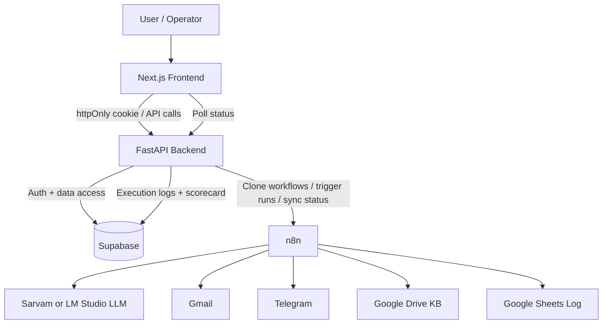
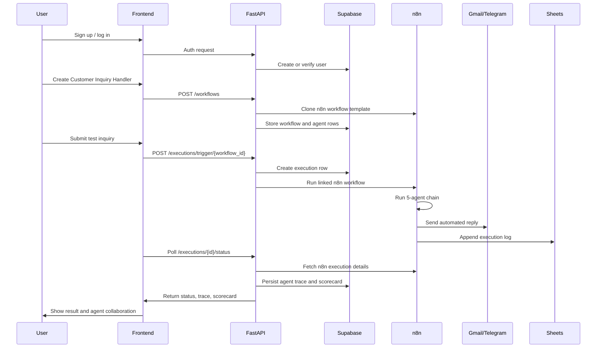
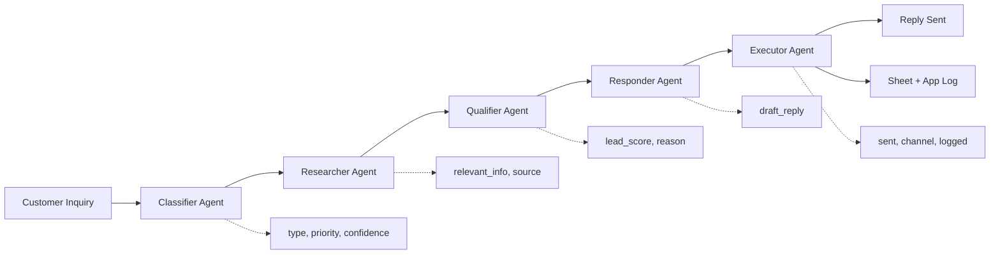
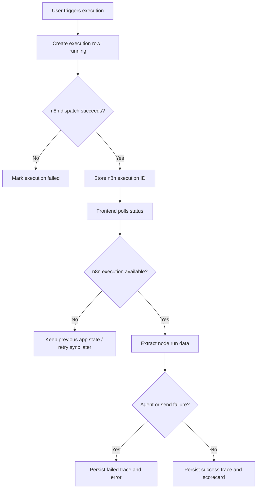

# Senior Tech Lead Questionnaire: n8n Inquiry Platform

This document prepares detailed answers for an instructor who is evaluating the project at a senior software engineer or tech lead level. The answers are intentionally honest about what is implemented, what is demo-complete, and what remains a limitation.

## Project Summary

The project is a local-first customer inquiry automation platform built with Next.js, FastAPI, n8n, Supabase, and LLM providers such as Sarvam or LM Studio. It allows a user to sign up, create a customer inquiry workflow, trigger test inquiries, watch a five-agent pipeline execute, receive an automated reply through supported channels, and inspect execution traces, history, analytics, exports, and scorecard-style metrics.

The implementation is demo-complete for the main workflow using Gmail/Telegram-capable n8n automation. It does not implement WhatsApp directly. Telegram is used as the messaging-channel substitute for the WhatsApp-style demo path.

## High-Level Architecture Diagram

## End-to-End Execution Diagram

## Agent Pipeline Diagram

## Completion Status

### Question: Is the project complete according to the original requirement?

Answer:
It is mostly complete for a working demo, but not perfectly complete against the wording if the instructor strictly requires WhatsApp.

The project supports user signup, workflow creation, n8n workflow cloning, a five-agent customer inquiry handler, test inquiry execution, agent trace visibility, automated reply delivery through Gmail/Telegram-capable flows, history, exports, analytics, and scorecard-style quality metrics.

The main limitation is that WhatsApp is not implemented. Telegram is used instead as the messaging-channel substitute. If the assignment explicitly requires WhatsApp, I would explain this as a deliberate integration tradeoff and propose adding WhatsApp Cloud API or Twilio WhatsApp as the next channel.

### Question: What evidence proves the demo works?

Answer:
The repository includes documentation showing live n8n execution evidence. `docs/test-matrix.md` records successful Telegram executions with IDs such as `171`, `172`, `174`, `176`, `177`, and `178`. These cover multiple inquiry intents including sales, support, complaint, general question, order request, and fallback knowledge-base retrieval.

The documented evidence confirms that the Telegram webhook started an active workflow, the Telegram send node returned success, Google Drive KB files were retrieved, and Google Sheets debug logging worked. The app also includes frontend pages for workflow execution, history detail, analytics, and export artifacts.

### Question: What is still incomplete or weaker than ideal?

Answer:
The strongest incomplete area is WhatsApp support. The code supports Gmail, Telegram, Google Drive, and Google Sheets integrations, but not WhatsApp.

The second weakness is that the strongest live evidence is Telegram-based. Gmail nodes and UI support exist, but the archived Gmail 10-case matrix was superseded by Telegram evidence. If Gmail is a hard requirement, a fresh Gmail reliability matrix should be run and documented.

The third weakness is real-time behavior. The UI uses polling every two seconds rather than WebSockets or Server-Sent Events, so it is near-real-time rather than true push-based real-time.

## Architecture Questions

### Question: Why did you choose n8n instead of building the orchestration engine yourself?

Answer:
n8n was chosen because the core problem is workflow orchestration and integration, not building another workflow engine. n8n already provides visual workflow design, retryable node execution, external integrations, execution history, credential management, and API access.

By using n8n, the project focuses on the product layer: authenticated workflow management, execution tracking, agent trace capture, scorecard generation, and an operator dashboard. Building a custom orchestration engine would require implementing graph execution, node scheduling, credential handling, external API integrations, execution logs, retries, and editor tooling. That would increase scope and reduce demo reliability.

The tradeoff is coupling to n8n’s execution data model and node naming conventions. The backend has to know which n8n node corresponds to which agent role.

### Question: What responsibilities belong to the frontend, backend, n8n, and Supabase?

Answer:
The frontend is responsible for user-facing operations: signup/login screens, workflow creation, execution controls, live trace display, history pages, analytics pages, integration status, and export links.

The backend is responsible for authentication enforcement, ownership checks, workflow CRUD, n8n API calls, execution lifecycle management, status synchronization, agent log extraction, scorecard derivation, and export generation.

n8n is responsible for executing the automation graph. It runs the actual five-agent workflow, calls the LLM, routes messages through Gmail or Telegram, retrieves Google Drive knowledge-base content, and logs information to Google Sheets.

Supabase stores application data: users/profiles, workflows, agents, executions, agent logs, and integration state. It allows the app to maintain its own queryable operational history instead of relying only on n8n’s internal execution history.

### Question: What is the source of truth: n8n or your database?

Answer:
There are two sources of truth depending on the type of data.

n8n is the runtime source of truth for actual workflow execution details because it runs the nodes and knows whether each node succeeded or failed.

Supabase is the application source of truth for users, ownership, workflows, execution records, normalized agent logs, and scorecard data. The backend syncs n8n execution details into Supabase so the frontend can show history and analytics without directly depending on n8n.

This split is intentional. It keeps n8n as the execution engine while the application owns product-level state and user-scoped access control.

### Question: Why is the workflow template cloned instead of dynamically generated from scratch?

Answer:
The workflow is cloned from a known-good template because this reduces runtime complexity and risk. A fixed n8n template guarantees that required nodes exist, credentials can be attached predictably, and the five-agent chain has stable node names.

Dynamic generation would be more flexible but also more fragile. It would require generating valid n8n node definitions, connections, credential references, validation nodes, and channel routing logic programmatically. For this project, cloning a tested template is the safer and more demo-reliable design.

### Question: How tightly coupled is the app to n8n node names?

Answer:
The app is moderately coupled to known n8n node names. The backend maps agent roles to node names like `Classifier_Agent`, `Researcher_Agent`, `Qualifier_Agent`, `Responder_Agent`, and `Executor_Agent`. This is used for prompt synchronization and log extraction.

The benefit is simplicity and deterministic behavior. The risk is template drift: if a node is renamed inside n8n, backend synchronization may break. A production system should version templates, validate required node names before activation, and possibly store node IDs in workflow metadata instead of relying only on names.

### Question: What design decision would you change for production?

Answer:
The first production change would be replacing polling with Server-Sent Events or WebSockets for execution updates. That would reduce repeated API calls and make the trace feel truly real-time.

The second change would be adding a queue between the backend and n8n so execution requests are durable and rate-limited. This would prevent bursts of user traffic from directly overloading n8n or third-party APIs.

The third change would be adding workflow template versioning and migration tooling. That would make it safer to roll out new workflow logic without breaking existing workflows.

## Multi-Agent Design Questions

### Question: Why are there five separate agents instead of one large prompt?

Answer:
The five-agent design separates concerns and makes the automation easier to observe and debug. A single prompt could classify, research, qualify, draft, and execute, but failures would be harder to isolate. With separate agents, the app can show exactly where a run failed or slowed down.

Each agent has a narrow responsibility and a structured JSON output. This allows validation after each step and creates a trace that is useful for the scorecard and instructor demo.

The tradeoff is added latency and more LLM calls. For a production system with cost constraints, some agents could be merged or converted into deterministic code.

### Question: What does each agent do?

Answer:
The Classifier Agent identifies the inquiry type, priority, and confidence. It determines whether the message is a sales inquiry, support ticket, complaint, general question, or order request.

The Researcher Agent uses the classification to retrieve relevant knowledge-base context, preferably from Google Drive. It outputs `relevant_info` and `source`.

The Qualifier Agent scores the request or lead from 1 to 10 and explains why. For example, a pricing or enterprise demo inquiry receives a higher lead score.

The Responder Agent drafts a professional reply using the original inquiry, classification, research, and qualification context.

The Executor Agent confirms the final response is ready to send and log. It outputs whether the reply was sent, which channel was used, and whether logging should happen.

### Question: How do agents pass information to each other?

Answer:
Agents pass structured JSON outputs through the n8n workflow. Each node receives prior outputs as part of its input context. The backend later extracts these outputs from n8n execution details and stores them as normalized agent logs.

This means the collaboration is both operational and observable. The agents are not just hidden prompt calls; their inputs, outputs, statuses, durations, and validation decisions can be shown in the UI.

### Question: How do you validate each agent’s output?

Answer:
Each agent is instructed to return compact raw JSON with specific required keys. The workflow contains validation logic to parse the output and check for required fields.

Examples of required keys are `type`, `priority`, and `confidence` for the classifier; `relevant_info` and `source` for the researcher; `lead_score` and `reason` for the qualifier; `draft_reply` for the responder; and `sent`, `channel`, and `logged` for the executor.

This reduces downstream errors because the workflow can detect malformed output before passing it to the next step.

### Question: How do you prevent hallucinated responses?

Answer:
The main hallucination mitigation is the Researcher Agent using Google Drive knowledge-base content. The responder is expected to use that retrieved context instead of inventing details.

There are also strict JSON output instructions and fallback behavior when information is missing. The responder prompt tells the agent to promise a follow-up when information is missing instead of inventing facts.

However, this does not eliminate hallucination completely. A stronger production design would add source citations, confidence checks, policy rules, approval-before-send for low confidence replies, and a separate evaluator that checks whether the response is grounded in retrieved knowledge.

### Question: Why is the Executor an agent instead of deterministic backend code?

Answer:
In this demo, the Executor Agent exists to complete the five-agent collaboration pattern and produce a visible final agent step. It confirms whether the reply is ready to send and log.

In a production system, I would move most executor behavior into deterministic code because sending emails, Telegram messages, or WhatsApp replies should not depend on an LLM. The LLM can draft and recommend, but the final side effect should be guarded by deterministic validation and policy checks.

## n8n Workflow Questions

### Question: Which n8n nodes are critical to the workflow?

Answer:
The critical nodes are the trigger nodes, the five agent nodes, validation/code nodes, channel routing nodes, Gmail or Telegram send nodes, Google Drive retrieval nodes, and Google Sheets logging nodes.

The required agent nodes are `Classifier_Agent`, `Researcher_Agent`, `Qualifier_Agent`, `Responder_Agent`, and `Executor_Agent`. These names matter because the backend expects them when synchronizing prompts and extracting trace data.

### Question: How do Gmail and Telegram triggers differ in this implementation?

Answer:
Gmail uses n8n’s Gmail trigger and Gmail send functionality. It is email-based and depends on Google OAuth credentials.

Telegram uses a Telegram trigger or webhook-style relay and sends replies through the Telegram Bot API. It depends on a Telegram bot token and Telegram credential configuration.

The app treats both as source channels at the execution level. The frontend can submit a test inquiry with a selected channel, and the workflow routes the reply accordingly.

### Question: Why does the project support Telegram but not WhatsApp?

Answer:
Telegram was used because it is faster and simpler to validate in a local demo. Telegram bots are easy to create, messages can be sent through a straightforward API, and n8n has good Telegram support.

WhatsApp requires Meta Business setup or a provider such as Twilio. That usually involves business verification, phone number configuration, webhook verification, templates for outbound messages, and stricter messaging policies. Because of that overhead, Telegram was selected as the practical messaging-channel substitute.

If WhatsApp is mandatory, the next step would be integrating WhatsApp Cloud API or Twilio WhatsApp into the same channel abstraction.

### Question: How would you add WhatsApp?

Answer:
I would add WhatsApp as a new source channel and integration type.

At the n8n level, I would add either WhatsApp Cloud API HTTP Request nodes or Twilio WhatsApp nodes. The workflow would need a WhatsApp trigger/webhook for incoming messages and a WhatsApp send node for replies.

At the backend level, I would extend channel types from `gmail`, `telegram`, and `test` to include `whatsapp`. I would also add integration verification for WhatsApp credentials and webhook configuration.

At the frontend level, I would add WhatsApp to the workflow creation channel selector, test inquiry channel selector, and integrations page.

At the data layer, I would store WhatsApp sender IDs or phone numbers carefully, because phone numbers are sensitive personal data.

### Question: How do you handle n8n API failures?

Answer:
The backend wraps n8n API calls and returns structured errors when n8n is unavailable or misconfigured. For execution trigger, the backend creates an execution row, tries to dispatch to n8n, and marks the execution as failed if dispatch fails.

The project also fails closed when n8n does not return a valid execution ID. This is important because the app should not claim that automation started if there is no actual n8n execution to track.

### Question: What happens if n8n completes but the backend fails to sync the result?

Answer:
The n8n execution may be complete, but the app execution row may remain stale until the backend successfully polls and syncs. Because the backend fetches execution details from n8n by execution ID, the result can be recovered on a later status request as long as n8n still has the execution data.

For production, I would improve this with scheduled reconciliation jobs that periodically sync running executions and mark stale ones as failed or recovered.

### Question: How do you avoid duplicate replies if a workflow is retried?

Answer:
The current implementation has retry controls, but duplicate prevention is not fully production-grade. If a retry is triggered after a previous execution already sent a reply, there is a risk of duplicate replies unless the workflow or backend checks idempotency.

For production, I would add idempotency keys based on the original message ID, sender, channel, and workflow ID. The executor should check whether a reply has already been sent before sending again.

## Backend Questions

### Question: Why did you use FastAPI?

Answer:
FastAPI is a good fit because it provides typed request/response models, dependency injection, async support, OpenAPI documentation, and clean modular routing. The backend has clear API domains: auth, workflows, executions, analytics, and system integrations.

FastAPI also works well for service orchestration because the backend needs to call n8n, Supabase, Telegram verification APIs, and export utilities.

### Question: What are the most important backend endpoints?

Answer:
The most important endpoints are authentication endpoints for register/login/logout/profile, workflow endpoints for creating and managing n8n-backed workflows, execution endpoints for trigger/status/trace/retry/cancel/pause/resume/export, integration endpoints for connect/verify/disconnect, and analytics endpoints for summaries and exports.

The central endpoint is `POST /executions/trigger/{workflow_id}` because it creates an app execution, dispatches the n8n workflow, stores the n8n execution ID, and starts the observable automation lifecycle.

### Question: How does authentication work?

Answer:
Authentication uses Supabase-issued JWTs. The backend validates the JWT from a cookie or bearer token and resolves the current user. The frontend stores session state through an httpOnly auth cookie set by the backend login flow.

Using httpOnly cookies helps reduce token exposure to client-side JavaScript. The backend then enforces ownership checks before returning or modifying workflows and executions.

### Question: How do you verify the current user owns a workflow or execution?

Answer:
The backend queries the database with both the resource ID and the current user ID. A workflow or execution is only returned if it belongs to the authenticated user.

This prevents one user from accessing another user’s workflow or execution simply by guessing an ID.

### Question: What happens when `POST /executions/trigger/{workflow_id}` is called?

Answer:
The backend first authenticates the user and verifies that the workflow belongs to that user. It creates an execution row in Supabase with status `running`, the source channel, sender ID, inquiry snippet, and initial scorecard detail.

Then it calls n8n to run the linked workflow. If n8n returns an execution ID, the backend stores it in the execution row and returns the app execution ID to the frontend. If n8n fails or does not return an execution ID, the backend marks the execution failed and returns an error.

### Question: How are agent logs extracted from n8n execution data?

Answer:
The backend calls the n8n execution detail endpoint with data included. It inspects the run data for known agent nodes and extracts each agent’s role, input, output, status, duration, validation result, missing keys, and error messages where available.

Those extracted logs are normalized and stored in the `agent_logs` table. This allows the frontend to render a stable trace without directly parsing n8n’s raw execution format.

### Question: How are pause, resume, retry, and cancel implemented?

Answer:
Cancel attempts to stop the n8n execution and marks the app execution as cancelled.

Pause stores a paused marker in `scorecard_detail` and attempts to stop the n8n execution. It is a logical application-level pause, not a true suspended n8n process.

Resume creates a new execution linked to the paused one using `resumed_from` metadata and dispatches the workflow again.

Retry creates another execution based on the previous execution and starts a fresh n8n run.

These controls are useful for reliability demos, but production-grade pause/resume would need deeper workflow checkpointing.

## Frontend Questions

### Question: How does the user create a workflow?

Answer:
The user opens the Workflows page, enters a name such as `Customer Inquiry Handler`, optionally adds a description, selects a trigger channel, and submits the form. The frontend sends a `POST /workflows` request to the backend.

The backend clones the n8n template, creates the n8n workflow, stores the application workflow row, and inserts default agent rows.

### Question: How does the frontend show real-time agent collaboration?

Answer:
After a test inquiry is triggered, the workflow detail page polls `/executions/{id}/status` every two seconds while the execution is running. The backend syncs n8n execution data and returns the latest trace. The frontend displays each agent role, status, duration, output, and error if present.

This creates a near-real-time view of the collaboration.

### Question: Is it true real-time or polling?

Answer:
It is polling-based near-real-time. The frontend polls every two seconds. It is not true push-based real-time because it does not use WebSockets or Server-Sent Events.

For a production version, I would use Server-Sent Events for one-way execution updates or WebSockets if bidirectional control was needed.

### Question: Where is the scorecard shown?

Answer:
The strongest scorecard display is in the history detail and analytics pages. History detail shows status, duration, score, sender, relevance, completeness, bottleneck insight, final reply, and agent trace.

The workflow detail page shows the live trace during execution. A future improvement would be to show the full scorecard immediately on the same workflow run page after completion.

### Question: How does the UI handle failed executions?

Answer:
The UI displays error boxes for API failures and shows execution status in the trace/history pages. Agent logs can include error messages. The workflow page also provides retry controls, allowing the operator to rerun a failed execution.

For production, I would improve this with clearer failure categories, suggested remediation, and direct links to relevant n8n execution logs.

## Database Questions

### Question: What tables does the system use?

Answer:
The main logical tables are `profiles`, `workflows`, `agents`, `executions`, `agent_logs`, and `data_sources`.

`profiles` stores user profile data. `workflows` stores user-owned workflow metadata and linked n8n workflow IDs. `agents` stores agent prompts and configuration. `executions` stores each run. `agent_logs` stores per-agent trace data. `data_sources` stores integration connection status.

### Question: Why store executions in Supabase if n8n already stores execution history?

Answer:
n8n execution history is runtime-specific and not ideal as the product’s primary data model. Supabase gives the app user-scoped, queryable, normalized execution data. It allows the frontend to show history, analytics, exports, and scorecards without exposing n8n directly.

It also supports ownership checks and application-specific metadata such as scorecard details, pause/resume markers, sender context, and linked workflow IDs.

### Question: What is stored in `scorecard_detail`?

Answer:
`scorecard_detail` stores contextual and derived metadata for an execution. It can include inquiry text, sender ID, pause/resume markers, n8n status, quality metrics, and bottleneck information.

Quality metrics include relevance score, completeness score, and overall quality score. Bottleneck information identifies the slowest agent role and explains where the workflow spent the most time.

### Question: What indexes would you add for scale?

Answer:
I would add indexes on `workflows.user_id`, `executions.user_id`, `executions.workflow_id`, `executions.status`, `executions.started_at`, `executions.source_channel`, and `agent_logs.execution_id`.

For multi-tenant production, I would also add organization/team IDs and index those fields. Most dashboard queries filter by user or organization and sort by creation or start time.

### Question: How would you handle schema migrations?

Answer:
The repository currently does not include a full migration system. For production, I would add migration tooling such as Supabase migrations, Alembic, or another versioned migration workflow.

Every schema change should be checked into the repo, tested against staging, and deployed before application code that depends on it.

## Security Questions

### Question: How are users authenticated?

Answer:
Users authenticate through Supabase auth. The backend validates Supabase JWTs and uses the authenticated user ID to scope database access.

The frontend uses an httpOnly cookie for session handling. This helps protect the auth token from direct JavaScript access.

### Question: Where are API keys stored?

Answer:
API keys and secrets should be stored in environment variables, not in frontend code. Examples include `N8N_API_KEY`, `SUPABASE_SERVICE_ROLE_KEY`, `SARVAM_API_KEY`, `TELEGRAM_BOT_TOKEN`, and Google-related credentials.

The frontend should only receive public configuration values such as the public backend URL. It should never receive service-role keys or n8n API keys.

### Question: What secrets should never be committed?

Answer:
Supabase service-role keys, JWT secrets, n8n API keys, n8n encryption keys, Google OAuth client secrets, Telegram bot tokens, Sarvam API keys, and any `.env` file with real credentials should never be committed.

If a real secret is accidentally committed, it should be rotated immediately, removed from the repo history if necessary, and replaced with a safe `.env.example` placeholder.

### Question: What are the risks of using Supabase service-role access in the backend?

Answer:
The service-role key bypasses row-level security, so it is powerful. If leaked, it could allow broad database access.

The mitigation is to keep it only on the backend, never expose it to the browser, and enforce ownership checks in backend code. In production, I would also use tighter service boundaries, secret management, logging, and least-privilege database access where possible.

### Question: Are Gmail or Telegram tokens exposed to the frontend?

Answer:
They should not be exposed to the frontend. Gmail credentials are managed through n8n credentials. Telegram bot tokens are environment-backed and verified from the backend/n8n side.

The frontend only triggers application APIs and displays integration status. It should not directly handle OAuth tokens or bot tokens.

### Question: How would you secure this for production?

Answer:
I would use HTTPS everywhere, proper secret management, strict CORS settings, secure cookie flags, CSRF protection where appropriate, audit logging, rate limiting, per-organization access control, webhook signature verification, and approval-before-send for sensitive replies.

I would also isolate n8n behind internal networking, avoid exposing its editor publicly, rotate keys, and monitor failed login and failed execution patterns.

## Reliability Questions

### Question: What are the main failure points?

Answer:
The main failure points are n8n availability, n8n credential configuration, LLM API failures, invalid LLM JSON, Google Drive retrieval failures, Gmail/Telegram send failures, Google Sheets logging failures, Supabase availability, and frontend/backend network failures.

Because the system depends on several external services, reliability depends heavily on clear failure handling and observability.

### Question: What happens if the LLM times out?

Answer:
If the LLM call times out inside n8n, the corresponding node can fail and the workflow may fail or use fallback behavior depending on the node. The backend then syncs that failure from n8n execution data and stores it in the execution trace.

For production, I would add timeout-specific handling, retries with backoff, lower-cost fallback models, and clear operator alerts.

### Question: What happens if Google Drive retrieval fails?

Answer:
If Google Drive retrieval fails, the Researcher Agent may have no knowledge-base content. The workflow can use fallback behavior such as returning no specific information or using a default fallback KB.

The documented test matrix shows that Drive retrieval was validated for multiple KB files after resolving file visibility issues.

### Question: How do you detect whether the reply was actually sent?

Answer:
The n8n send node response is the primary signal. For Telegram, the documented evidence includes send responses with `ok: true`. For Gmail, the Gmail send node response would need to be checked in n8n execution data.

The Executor Agent’s `sent` field alone is not enough because it is an LLM-generated confirmation. The true proof should come from the external send node response and channel-side evidence.

### Question: What does “fail closed” mean in this project?

Answer:
Fail closed means the system should not mark a step as connected, dispatched, or successful unless it has actual evidence.

For example, the backend now requires a non-null n8n execution ID after dispatch. If n8n does not return an execution ID, the app marks the execution failed instead of pretending it started.

Similarly, integration connect/verify flows check live n8n credential references before marking sources as connected.

## Failure Flow Diagram

## Testing Questions

### Question: What test evidence do you have?

Answer:
The repository contains multiple verification documents. `docs/test-matrix.md` records live Telegram workflow evidence and Google Drive KB retrieval evidence. `docs/day-7-analytics-verification.md` records API and frontend checks for history, analytics, and exports.

There are also saved export artifacts under `docs/day7-artifacts/` for one execution.

### Question: Did you run the full 10-case Gmail matrix?

Answer:
The original Gmail 10-case matrix is archived in the docs and was superseded by Telegram-based evidence. So the honest answer is that the strongest documented live matrix is Telegram, not Gmail.

If the instructor requires Gmail specifically, the next step is to activate the Gmail workflow, send 10 test emails, capture the n8n execution IDs, verify Gmail replies, verify Sheets rows, and update the matrix.

### Question: How would you test Gmail end-to-end?

Answer:
I would prepare 10 inquiry emails covering sales, support, complaint, general question, and order request. For each case, I would record the original email, n8n execution ID, classifier output, researcher output, qualifier output, responder output, executor output, Gmail send result, and Google Sheets row.

The acceptance criteria would be at least 9 out of 10 fully successful runs with valid JSON at each agent, reply delivered, and sheet row appended.

### Question: How would you mock n8n in automated tests?

Answer:
I would mock the n8n API endpoints used by the backend: workflow creation, workflow update, workflow run, execution detail retrieval, and execution stop. The mocked responses would include successful execution details, failed node details, malformed agent output, missing execution ID, and unavailable n8n responses.

This would allow testing backend behavior without requiring a live n8n instance for every CI run.

### Question: What unit tests would you add first?

Answer:
I would add tests for extracting agent logs from n8n execution details, deriving scorecard metrics, handling missing n8n execution IDs, enforcing workflow ownership, and validating integration verification failure paths.

These are high-value because they cover correctness and safety in the backend logic.

## Scorecard And Analytics Questions

### Question: What does the scorecard prove?

Answer:
The scorecard proves that the app captured and interpreted the execution outcome. It shows whether the workflow completed, what reply was generated, what each agent produced, how long the run took, and basic quality indicators such as relevance and completeness.

It does not mathematically prove that the response is perfect or fully correct. It is an operational confidence signal, not a formal correctness proof.

### Question: How is the score calculated?

Answer:
The score is derived from execution logs and final reply content. Relevance is based on overlap between inquiry tokens and reply tokens. Completeness increases when key agents complete successfully and when the final reply exists. Overall score is derived from these quality metrics and mapped to a 1-10 style score.

This is intentionally lightweight and explainable, but it is heuristic.

### Question: Is the score model-based or heuristic?

Answer:
It is heuristic and log-driven. It is not generated by a separate evaluation model.

For a production-grade evaluator, I would add a separate judge model that checks grounding, answer completeness, tone, policy compliance, and whether the final reply uses retrieved KB facts.

### Question: Can the scorecard falsely report success?

Answer:
Yes, it can. Since the scorecard is heuristic, it can overestimate quality if the reply contains overlapping words but is still wrong. It can also mark the agent pipeline as complete even if the external business outcome is imperfect.

The mitigation is to use external send-node responses, validation rules, sheet logs, and optionally an evaluator model. The scorecard should be treated as evidence, not absolute proof.

### Question: What analytics are most useful?

Answer:
The most useful analytics are total executions, success rate, average duration, average score, per-agent success rate, and bottleneck role. These help an operator identify whether the automation is reliable and which agent or integration is slowing down the workflow.

## Scalability Questions

### Question: How many concurrent executions can this design handle?

Answer:
The current design is suitable for a local demo and small operational use. The exact concurrency depends on n8n worker capacity, LLM rate limits, database performance, and third-party API quotas.

At higher scale, the first bottlenecks are likely to be n8n execution concurrency, LLM API rate limits, and frontend polling load.

### Question: How would you scale the backend?

Answer:
The backend can be scaled horizontally because most state is stored in Supabase and n8n. Multiple FastAPI instances could run behind a load balancer.

However, execution dispatch should be made idempotent and queue-backed before scaling heavily. Otherwise, duplicate requests or retries could create duplicate n8n runs.

### Question: How would you scale n8n?

Answer:
For production, I would run n8n in queue mode with separate web and worker processes, backed by Redis and a production database. Workers could be scaled independently based on execution load.

I would also configure concurrency limits and rate limits for external APIs.

### Question: Would polling create load at scale?

Answer:
Yes. Polling every two seconds is acceptable for a demo, but at scale it creates unnecessary backend and n8n load. If many users watch many executions, polling can become expensive.

Server-Sent Events or WebSockets would be better. The backend could push execution updates to clients after syncing from n8n or receiving webhook callbacks.

### Question: Why is there no vector database?

Answer:
The project uses operational retrieval from Google Drive KB files rather than semantic vector search. This is simpler and enough for the demo’s intent-based KB mapping.

A vector database would be useful if the knowledge base became large, unstructured, and needed semantic search across many documents. For the current scope, Google Drive retrieval keeps the system simpler.

## Production Readiness Questions

### Question: Is this production-ready or demo-ready?

Answer:
It is demo-ready and production-leaning in structure, but not fully production-ready.

It has solid separation of concerns, authentication, n8n integration, execution tracking, trace capture, and analytics. But production readiness would require stronger monitoring, alerting, idempotency, WhatsApp support if required, queue-backed execution, secure deployment hardening, migration tooling, and approval workflows.

### Question: What must be added before real customers use it?

Answer:
Before real customer use, I would add WhatsApp if required, approval-before-send, stronger PII handling, audit logs, webhook verification, idempotency, automated tests, production secrets management, monitoring, alerting, queue-based execution, and a human override path.

I would also add template versioning and rollback support for n8n workflows.

### Question: How would you monitor it?

Answer:
I would monitor backend API latency and errors, n8n execution success rate, LLM latency and failures, channel send success, Google Drive retrieval success, Google Sheets logging success, queue depth, and stale running executions.

Alerts should fire when success rate drops, n8n is unavailable, integration verification fails, or executions remain running too long.

### Question: How would you roll back a broken workflow template?

Answer:
I would version workflow templates and store the template version used by each workflow. If a new template breaks execution, new workflows can be created from the previous version and existing workflows can be migrated back or left on the stable version.

In n8n, I would avoid manually editing production workflows without exporting and versioning the JSON.

### Question: How would you add approval-before-send?

Answer:
I would split response generation from response delivery. The responder would draft the reply, then the execution would pause in a pending approval state. The frontend would show the draft, trace, and scorecard. A human operator could approve, edit, or reject it.

Only after approval would the deterministic executor send the message through Gmail, Telegram, or WhatsApp.

## Project-Specific Tough Questions

### Question: The requirement says WhatsApp. Why does your project use Telegram?

Answer:
Telegram was used as the demo messaging channel because it is faster to configure, easy to test locally, and well-supported by n8n. WhatsApp requires Meta Business or Twilio setup, webhook verification, phone number configuration, and sometimes message templates.

I would be transparent that WhatsApp is not complete. The architecture is channel-oriented, so WhatsApp can be added by extending the channel enum, integration verification, frontend selectors, and n8n send/trigger nodes.

### Question: The requirement says “real time.” Why is your implementation polling?

Answer:
The current implementation uses two-second polling because it is simpler and reliable for a demo. It provides near-real-time visibility into agent progress without the complexity of WebSockets or Server-Sent Events.

For a production system, I would replace polling with SSE or WebSockets. SSE is probably enough because execution updates are mostly one-way from server to client.

### Question: Your docs say the Gmail matrix is archived. Is Gmail fully verified?

Answer:
The code and template support Gmail nodes and credential verification, but the strongest documented live matrix is Telegram. The Gmail 10-case matrix is archived and was superseded by Telegram evidence.

So the honest answer is: Gmail support exists, but if Gmail is required as the primary evidence channel, I should run and document a fresh 10-case Gmail matrix.

### Question: What exactly is pending in `whats_left.md`?

Answer:
`whats_left.md` notes that the full 10-case reliability matrix with live operator execution IDs is still pending, and analytics metrics validation on real runs is also listed as pending. Some other items like live n8n dispatch hardening, Telegram parity, real Google Drive retrieval, integration validation, and trace sync are marked complete.

There is a small documentation mismatch because `docs/test-matrix.md` says the demo baseline is complete based on Telegram evidence, while `whats_left.md` still calls out the full 10-case operator matrix as pending.

### Question: Can you show the n8n execution ID and corresponding app execution ID?

Answer:
For documented n8n evidence, I can show execution IDs from `docs/test-matrix.md`, such as `171`, `172`, `174`, `176`, `177`, and `178`. For app execution IDs, I can show entries from the History page or execution detail API if the local environment has the corresponding Supabase records.

The important design point is that app executions store the `n8n_execution_id`, linking the application record to the actual n8n run.

### Question: Can you show the automated reply that was sent?

Answer:
The final reply is stored in the execution record and shown in the History detail page. The n8n send node response is also visible in n8n execution details.

For a live demo, I would submit a test inquiry, wait for completion, open the History detail, show the final reply and agent trace, then show the Telegram/Gmail received message as external confirmation.

### Question: Can you show the Google Sheet row that was appended?

Answer:
The documented test matrix confirms Sheets debug logging for Telegram runs. In a live demo, I would open the configured Google Sheet after the workflow completes and show the newly appended row with the execution data.

This external side effect is useful because it proves the workflow did more than update internal app state.

### Question: What would fail if the instructor deletes one n8n credential?

Answer:
If the Gmail credential is deleted, Gmail trigger or send nodes can fail, and integration verification should fail. If the Telegram credential or bot token is deleted, Telegram send/trigger behavior can fail. If Google Drive credentials are deleted, KB retrieval can fail. If Google Sheets credentials are deleted, logging can fail.

The app’s integration verification is designed to catch missing credential references before claiming that an integration is connected.

## Best Short Answers To Memorize

### Question: What is the one-line explanation of this project?

Answer:
It is an authenticated dashboard that uses n8n to run a five-agent customer inquiry workflow, send an automated reply, and show a traceable scorecard proving what happened.

### Question: What is the biggest technical tradeoff?

Answer:
The biggest tradeoff is using n8n and fixed templates for speed and reliability, while accepting some coupling to n8n node names and template structure.

### Question: What is the most important limitation?

Answer:
The most important limitation is that WhatsApp is not implemented directly; Telegram is used as the messaging-channel substitute.

### Question: What is the most production-critical improvement?

Answer:
The most production-critical improvement is adding idempotency, approval-before-send, and queue-backed execution so the system avoids duplicate replies and handles failures safely.

### Question: What part are you most confident about?

Answer:
I am most confident about the architecture separation: frontend for operations, FastAPI for orchestration and access control, n8n for workflow execution, and Supabase for application state and trace history.

### Question: What part would you improve first with one more week?

Answer:
I would add WhatsApp Cloud API support, replace polling with SSE, run a full Gmail reliability matrix, and improve the scorecard with a model-based evaluator.
